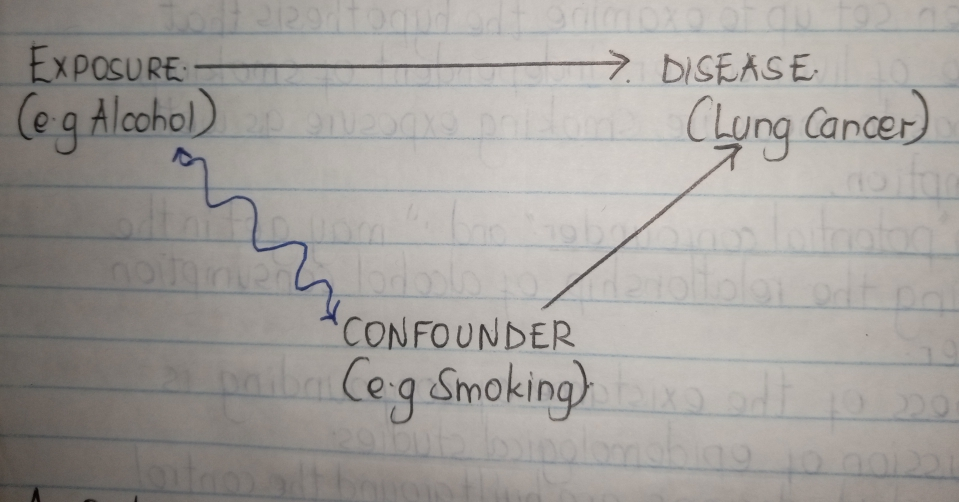
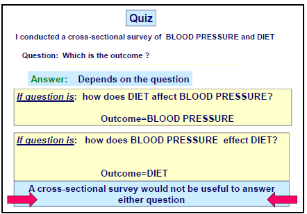
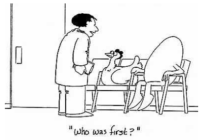
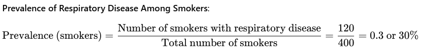
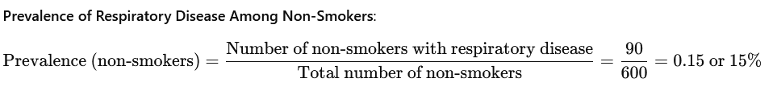
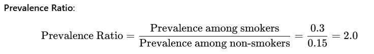

<script type="text/javascript"
  src="http://cdn.mathjax.org/mathjax/latest/MathJax.js?config=TeX-AMS-MML_HTMLorMML">
</script>

```{r style, echo=FALSE, message=FALSE, warning=FALSE, results="asis"}
suppressPackageStartupMessages({
 # library(BiocStyle)
  library(knitr)
  library(rmarkdown)
  library(bookdown)
})
options(width = 100)
opts_chunk$set(fig.width = 5, fig.height = 5)

```

```{r,echo=FALSE}
library(e1071)
library(lattice)
library(ggplot2)
library(mvtnorm)
#library(tinytex)
```

# Introduction

## What is Epidemiology?

In our previous session, we gave several definitions of the term Epidemiology and expounded on the same. However, we narrowed down to this definition as our working definition for this class and beyond. That is; the study of [**frequency**]{.underline}**, [distribution]{.underline}** and [**determinants**]{.underline} of diseases and other [**health related conditions**]{.underline} in human [**population**]{.underline} and [**the application of this study to the promotion of health**]{.underline} and prevention or control of health problems.

-   **Population**: The main focus of epidemiology is on the effect of teh disease on the population rather than the individual. E.g. Malaria affects many people in western region of Kenya while Lung cancer is rare in the same region. If an individual develops Lung cancer, it is more likely that they will die. Even though lung cancer is a more killer disease, epidemiology gives more emphasis to malaria because if affects many people.

-   **Frequency:** This shows that epidemiology is mainly a quantitative science . Epidemiology is concerned with the frequency (occurrence)

-   **Health related conditions**: Epidemiology is concerned not only with disease but also with other health related conditions because every thing around us and what we do also affects our health Health related conditions are conditions which directly or indirectly affect or influence health These may be injuries, births, health related behaviors like smoking, unemployment, poverty etc

-   **Distribution:** Distribution refers to the geographical distribution of diseases , the distribution in time, and distribution by type of persons affected.

-   **Determinants:** Determinants are factors which determine whether or not a person will get a disease

-   **Application of these studies in the promotion of health** to prevent and control the health problems.

    NB: The whole aim of studying the [**frequency**]{.underline}**, [distribution]{.underline}** and [**determinants**]{.underline} of diseases is to identify effective disease prevention and control strategies.

## History of Epidemiology

-   Epidemiology is the cornerstone of public health, and informs policy decisions and evidence-based medicine by identifying risk factors for disease and targets for preventive medicine.

-   Epidemiologists help with study design, collection and statistical analysis of data, and interpretation and dissemination of results.

-   Epidemiology has helped develop methodology used in clinical research, public health studies and, to a lesser extent, basic research in the biological sciences

-   The Greek physician Hippocrates is known as the father of medicine, and was the first epidemiologist. Hippocrates sought a logic to sickness. He is the first person known to have examined the relationships between the occurrence of disease and environmental influences.

-   Hippocrates believed sickness of the human body to be caused by an imbalance of the four Humors (air, fire, water and earth “atoms”). The cure to the sickness was to remove or add the humor in question to balance the body. This belief led to the application of bloodletting and dieting in medicine.

-   The distinction between “epidemic” and “endemic” was first drawn by Hippocrates, to distinguish between diseases that are “visited upon” a population (epidemic) from those that “reside within” a population (endemic).

-   The term “epidemiology” appears to have first been used to describe the study of epidemics in 1802 by the Spanish physician Joaquín de Villalba in Epidemiología Española. Epidemiologists also study the interaction of diseases in a population, a condition known as a syndemic.

-   Dr. John Snow is famous for his investigations into the causes of the 19^th^ century cholera epidemics, and is also known as the father of (modern) epidemiology. He began by noticing the significantly higher death rates in two areas supplied by Southwark Company. His identification of the Broad Street pump as the cause of the Soho epidemic is considered the classic example of epidemiology. He used chlorine in an attempt to clean the water and had the handle removed, thus ending the outbreak. This has been perceived as a major event in the history of public health and regarded as the founding event of the science of epidemiology, having helped shape public health policies around the world. However, Snow’s research and preventive measures to avoid further outbreaks were not fully accepted or put into practice until after his death.

-   In the early 20^th^ century, mathematical methods were introduced into epidemiology by Ronald Ross, Anderson Gray McKendrick and others. Another breakthrough was the 1954 publication of the results of a British Doctors Study, led by Richard Doll and Austin Bradford Hill, which lent very strong statistical support to the suspicion that tobacco smoking was linked to lung cancer.

## Uses of Epidemiology

1.  To make a community diagnosis

2.  Epidemiology helps to identify and describe health problems in a community ( for example , the prevalence of anemia, or the nutrition status of children

3.  To monitor continuously over a period of time the change of health in a community. (for example, the effect of a vaccination programme, health education, nutritional supplementation).

4.  To practice surveillance for a specific disease in order to be able to act quickly and so cut short any outbreak (example cholera).

5.  To investigate an outbreak of a communicable disease, analyze the reasons for it, plan a feasible remedy.

6.  To plan effective health services. Effective services, interventions and remedies all depend on accurate community data

## Approaches in Epidemiology

**Descriptive Epidemiology** and **Analytical Epidemiology** are two fundamental approaches in the study of disease patterns and determinants in populations.

### **Descriptive Epidemiology**

Descriptive epidemiology focuses on summarizing and describing the distribution of diseases or health outcomes within a population. It answers the **"who, what, when, and where"** questions of disease occurrence.

**Key Characteristics:**

-   **Who** is affected (e.g., age, gender, occupation)?

-   **What** is the disease or health condition?

-   **When** does the disease occur (seasonality, time trends)?

-   **Where** is the disease occurring (geographical distribution)?

**Purpose:**

-   To identify patterns or trends in health-related conditions.

-   To generate hypotheses about possible causes of diseases.

-   To provide a basis for public health planning and resource allocation.

**Examples:**

-   The number of new HIV cases reported in a specific year in a particular country.

-   Age-specific death rates from cardiovascular disease in different regions.

### **Analytical Epidemiology**

Analytical epidemiology goes beyond description and focuses on understanding the **causes** and **determinants** of health outcomes. It aims to test specific hypotheses by determining **why** and **how** diseases occur.

**Key Characteristics**

-   **Why** is the disease occurring (risk factors)?

-   **How** is the disease spreading (transmission mechanisms)?

**Purpose**

-   To identify and quantify the relationships between exposures (e.g., risk factors, behaviors) and health outcomes.

-   To test hypotheses generated from descriptive studies.

-   To determine the effectiveness of interventions.

**Examples:**

-   Investigating whether smoking is associated with lung cancer by comparing smokers and non-smokers.

-   A study examining whether a new vaccine reduces the risk of a particular disease.

In descriptive studies, there are three characteristics of the disease that we that we look at. These include Person, Place and Time (PPT)

**Person**

An individuals characteristics can increase of decrease the risk for developing an illness. For example, the elderly and very young are often at elevated risk for bacterial and viral infections. Average (median), minimum, and maximum ages of cases, as well as proportions of cases according to sex and other relevant variables, should be part of any descriptive analysis. Cross-tabulations among these variables may be calculated to identify inter-relationships. Analyses of case demographics may provide insight into the source of an outbreak, for example, if the majority of cases are female, young or old, or from a specific ethnic group or religious community. In addition, the following should also be considered;

-   ethnic group

-   concurrent disease

-   diet, physical activity, smoking

-   risk taking behavior

-   socio-economic status

-   education

-   occupation

**Place**

The disease causing organisms do not necessarily respect or follow political borders in a country or region. Therefore, an examination of the ***spatial associations*** of cases can play a key role in determining the source of, say an outbreak. For example, the distribution of cases amongst constituencies in Nairobi County could be a reflection of the availability of contaminated food product that may have been distributed my say the county government or a politician. Thus, maps may be a useful tool in describing these spatial associations. Other factors to consider here include;

-   presence of agents or vectors

-   cliate

-   geology

-   population density

-   economic development

-   cultural practices

-   medical practices

**Time**

For us to be able to asses if disease incident rates or case numbers are changing, time is very important in characterizing the illness. Here, we need to consider the following;

-   calendar time

-   time since the event

-   age (time since birth)

-   seasonality

-   temporal trends

## Epidemiologic Approach

Just like any other scientific endeavor relies on a system of scientific approach, epidemiology does the same. In very simple terms, epidemiologists;

i.  count **cases** of health related events and describe the in terms of time, place and person.
ii. divides the number of cases by an *appropriate number* to calculate the **ratios** or **rates**
iii. compares these rates over time for different groups of people

**A [case]{.underline} in Epidemiology**

Before counting cases, an epidemiologist must decide on what to count i.e. what to call **a case**. Hence, an epidemiologist uses a **case definition**.

A *case definition is a set of standard criteria for classifying whether a person has a particular disease or symptom or other health condition*.

Some case definitions, particularly those use for national surveillance have been developed and adopted as **national standards that ensures comparability**.

The use of an agreed upon standard case definition ensures that every case is equivalent, regardless of when or where it occurred or who identified it. The number of cases or rate of diseases identified in the time or place can be compared with the number /rate for another time or place.

## Disease Causation

The cause of disease is an *event*, *condition*, *characteristic* or a ***combination*** of these factors which plays an important role in producing the disease

The causes of disease can be classified into two groups;

**Primary causes**

-   these are the factors which are necessary for a disease to occur, in whose absence the disease will not occur The term ”etiologic agent” can be used instead of primary cause for Infectious causes of diseases. For example “Mycobacterium tuberculosis” is the primary cause etiologic agent of pulmonary tuberculosis

**Risk factors**

-   these are the contributing, predisposing, or aggravating factors

-   they are not necessarily causes of a disease but are important for a disease to occur.

-   a factor associated with an increased risk of the occurrence of a disease is called a **Risk factor** for the exposed group, while a factor that is associated with decreased occurrence of a disease is known as a risk factor for the non-exposed group.

-   the etiology of a disease is the sub-total of all factors (primary causes and risk factors) which contributes to the occurrence of a disease.

## The epidemiologic triangle (triad)

For us to understand how diseases spread, it is essential for us to learn about diseases and how they move through populations, and what allows them to survive and thrive. In this way, epidemiologists effectively study and fight the spread of disease

The Epidemiologic Triangle (triad) is a model that scientists have developed for studying health problems. It is useful in understanding the how diseases spread, especially infectious diseases. The model is very simple and represents a high-concept, bird’s-eye view of infectious diseases.

Epidemiologic triangle is a model for explaining the organism causing the disease and the conditions that allow it to reproduce and spread.

The following figure illustrates the relationship among the three key factors in the occurrence of a disease (outcome).


**Agent**

An agent is a factor whose absence or presence, excess or deficit is necessary for a disease to occur. This may be a biological factor or a chemical agent which influences the occurrence of a disease or its severity.

The agent is the microorganism that actually causes the disease in question. An agent could be some form of **bacteria, virus, fungus, or parasite**.

**Host**

Consists of personal traits (sex , race , age, occupation, nutrition, heredity, marital status) , behavior, genetics, predisposition and immunologic factors.

The agent infects the host, which is the organism that carries the disease. A host doesn’t necessarily get sick; hosts can act as carriers for an agent without displaying any outward symptoms of the disease. Hosts get sick or carry an agent because some part of their physiology is hospitable or attractive to the agent.

**Environment**

Includes external factors other than the agent that influence health. They include : temperature , humidity, altitude, water, radiation, pollution, housing conditions , Food/milk

These factors are further characterized as to whether they belong to **social**, **physical** or **biological** environments.

**Social environment** - encampuses a broad range of factors including *education, unemployment, culture, political practices, legal, economic, communication, transport and health care system*.

**Physical environment** - factors include physical environment

**Biological environment** - includes vectors, human beings e.t.c

**An Illustrative Example**

The following example can be used to explain the spread of existing diseases.

The HIV epidemic reached its height in 1985, when there were roughly 130,000 annual cases of infection. Since that time, reported annual infections have decreased dramatically, though the CDC estimates that there are currently around 1.2 million people in the United States living with HIV. By better understanding how HIV is communicated, epidemiologists were able to make progress on treatment and prevention.

**Agent**

HIV is a viral infection that targets a person’s immune system, making it more vulnerable to other forms of infection. Because the virus targets the immune system itself, the body cannot effectively fight HIV on its own. HIV is communicated through direct contact with an infected person’s bodily fluids, and it primarily spreads through sexual contact or shared needles.

**Host**

Scientists theorize that HIV was originally carried by chimpanzees and that humans who hunted these chimpanzees for meat became infected with a mutated form of the virus upon contact with the chimpanzees’ blood. HIV can be transmitted when a bodily fluid such as blood comes into contact with a mucous membrane or damaged tissue (such as an open wound or the mucous membranes found inside the mouth).

**Environment**

There are a number of socioeconomic factors that can impact the spread of HIV within a community. Communities with higher concentrations of sexually transmitted diseases and lower incidences of reporting — due to social pressure or otherwise — allow HIV to flourish. Poverty limits access to care and treatment, and discrimination can discourage individuals from being tested or seeking care.

*source:* <https://www.rivier.edu/academics/blog-posts/what-is-the-epidemiologic-triangle/>

***Note:*** From the perspective of this triangle, the host, agent and environment co-exist harmoniously. However, a disease or injury only occurs when there is altered equilibrium between them. Furthermore, epidemics occur when;

-   the host, agent and environment factors are not in balance

-   due to a new agent being introduced in the equation

-   due to change in an existing agent

-   due to change in the number of susceptible in the population

-   due to the environmental changes that affect transmission of the agent or growth of the agent

# Measures of Disease Frequency

## Introduction

A measure of central location provides a single value that summarizes an entire distribution of data. In contrast, a frequency measure characterizes only part of the distribution.

Frequency measures compare one part of the distribution to another part of the distribution, or to the entire distribution. Common frequency measures are ratios, proportions, and rates. All three frequency measures have the same basic form:

-   numerator/denominator \*10^n^

-   Recall that: 10^0^= 1 (anything raised to the 0 power equals 1)

-   10^1^ = 10 (anything raised to the 1st power is the value itself)

-   10^2^ = 10 x 10 = 100

-   10^3^ = 10 x 10 x 10 = 1,000

So the fraction of (numerator/denominator) can be multiplied by 1, 10,

100, 1000, and so on. This multiplier varies by measure and will be

addressed in each section.

So the fraction of (numerator/denominator) can be multiplied by 1, 10, 100, 1000, and so on. This multiplier varies by measure and will be addressed in each section.

## Measures of Frequency (Ratio, Proportion, Rate)

-   A comparison between the practice of **public health** and the more familiar practice of **health care** helps in describing **epidemiology**.

-   First, where health care practitioners **collect data** on an individual patient by taking a medical history and conducting a physical exam, epidemiologists **collect data about an entire population** through surveillance systems or descriptive epidemiological studies.

-   The health care practitioner uses his or her data to make a **differential diagnosis.** The epidemiologist's data is used to **generate hypotheses about the relationships between exposure and disease**.

-   **Both disciplines then test the hypotheses**, the health care practitioner by conducting additional **diagnostic studies or tests**, the epidemiologist by conducting **analytical studies** such as cohort or case-control studies.

-   The final step is to take action. The health care practitioner **prescribes medical treatment**, and the epidemiologist, some form of **community intervention to end the health problem and prevent its recurrence.**

# Morbidity measures in Epidemiology

Morbidity refers to the presence of **disease, injury, or disability** in a population. It can be measured in several ways, depending on the type of disease, its duration, and the population under study using various epidemiological tools.

These measures help assess the burden of diseases and guide public health interventions.

While there are many measures of morbidity, epidemiologists most often estimate the occurrence of disease in a population in terms of **incidence** or **prevalence** of a disease. The main difference between the two measures is the time of a the disease onset.

For incidence, it quantifies the development of disease and can be estimated using data from a disease registry or a cohort trial.

There is always the assumption of the period of time when talking about incidence, for example we could say **new cases within a month or a year**.

The summary incident rate can be used to estimate risk e.g probability of disease in an individual, if the risk is constant across summarized groups.

## Incidence

Incidence is the number of new cases of a disease that occur in a specific population during a defined time period.

### Incidence Rate

This is computed as 

**Example**: In a city of 100,000 people, 500 new cases of tuberculosis (TB) are diagnosed [**over a year**]{.underline}. The incidence rate of TB would be:

Incident Rate =


**Use**: Incidence is used to measure diseases that develop over time, such as infectious diseases (e.g., flu, tuberculosis) or chronic conditions like type 2 diabetes

### **Cumulative Incidence**

**Cumulative incidence** is a measure of the proportion of individuals in a population who develop a specific disease or condition over a defined period of time. It provides an estimate of the risk of developing the disease during the time period, focusing on new cases.

{width="519"}

Where:

-   **Number of new cases of disease**: The individuals who develop the disease during the specified time period.

-   **Population at risk**: The individuals who are initially free of the disease at the start of the period and are followed for the outcome.

**Example**

In a cohort of 1,000 individuals who are free of heart disease at the start of the year, 50 new cases of heart disease are reported at the end of the year.

**Cumulative Incidence Calculation**

CI=50/1000\*100 = 5%

**Interpretation**

The cumulative incidence of heart disease in this population over one year is **5%**, meaning that 5% of the population developed heart disease within that time period.

**Uses**

Cumulative incidence is useful for estimating the **risk** of disease in a closed population over a fixed period. It is often used in cohort studies and clinical trials to assess the development of new diseases or health outcomes.

### **Incidence Density (Incidence Rate)**

**Incidence Density** (also known as the **Incidence Rate**) is a measure in epidemiology that estimates the occurrence of new cases of a disease in a population over a specific amount of **person-time**.

Unlike [cumulative incidence]{.underline}, which is based on a fixed population over a period of time, incidence density accounts for varying periods of observation for each individual, making it useful when follow-up time differs across individuals in the population. This can be obtained as follows,

{width="403"}

Where:

-   **Number of new cases of disease**: The number of individuals who develop the disease during the observation period.

-   **Total person-time at risk**: The sum of the time each individual was at risk of developing the disease (e.g., years, months, or days of observation for each person).

**Note:**

-   **Person-time** is used when individuals are observed for different lengths of time. For example, some individuals may enter or leave the study at different points, or they may develop the disease (and no longer be at risk).

-   Incidence density is expressed as cases per unit of person-time (e.g., cases per 100 person-years).

-   This provides a dynamic measure of how fast new cases of disease occur in a population.

**Example**

In a study, 200 people are followed for varying amounts of time to observe the occurrence of a disease. The total observation time is 400 person-years (this accounts for the fact that some people were followed for longer than others). During this time, 40 new cases of the disease are recorded.

**Incidence Density Calculation**:

-   **Number of new cases** = 40

-   **Total person-time** = 400 person-years

    that is ID= 40/400 = 0.1 cases per person-year

**Interpretation**

The incidence density is **0.1 cases per person-year**, meaning that, on average, there were 0.1 new cases of the disease for each person followed for one year. Alternatively, this can be expressed as **10 cases per 100 person-years**.

**Uses**

Incidence density is particularly useful in studies where:

-   Individuals are followed for different lengths of time.

-   You want to understand the **rate** at which new cases occur in a dynamic population.

It is commonly used in clinical trials and cohort studies with long follow-up periods, or where participants enter and leave the study at different times.

## **Attack Rate**

-   Attack rate is a type of incidence rate, usually used during outbreaks, which measures the proportion of people exposed to a disease who become ill.

{width="502"}

-   **Example**: In a group of 100 people who attended a party, 40 people developed food poisoning after eating contaminated food. The attack rate would be:

40 / 100 = 0.4 = 40%

-   **Use**: Attack rates are commonly used in outbreak investigations, such as during foodborne illness outbreaks or infectious disease outbreaks (e.g., measles).

We previously mentioned that a variety of attack rates can be calculated. That is

-   Overall attack rate is the total number of new cases divided by the total population.

-   A food-specific attack rate is the number of persons who ate a specified food and became ill divided by the total number of persons who ate that food, as illustrated in the previous potato salad example.

-   A secondary attack rate (SAR) is sometimes calculated to document the difference between community transmission of illness versus transmission of illness in a household, barracks, or other closed population.

-   SAR is defined as the number of exposed persons developing the disease within the range of incubation period following exposure to a primary case

**Secondary Attack Rate (SAR)**

The **Secondary Attack Rate (SAR)** is an epidemiological measure used to estimate the spread of a **contagious disease** within a defined group, such as a household, school, or other close-contact settings. It quantifies the proportion of susceptible individuals who become infected after exposure to a **primary case** (the first individual who contracted the disease).

{width="493"}

Where:

-   **New cases among contacts**: People who develop the disease after exposure to the primary case.

-   **Susceptible contacts**: People who were at risk of getting the disease (i.e., they have no immunity and were in close contact with the index case).

**Example: SAR Calculation in a Household**

Imagine there is an outbreak of influenza in a household. The first person to develop symptoms is identified as the **index case**. There are 5 other people in the household, all of whom are susceptible because none have been vaccinated or had prior exposure to the virus.

-   **Total susceptible contacts** = 5

-   During the outbreak, 3 of the 5 household members develop influenza after contact with the index case.

SAR = 3/5 \* 100 = 60%

**Interpretation**

In this household, the **Secondary Attack Rate** is **60%**, meaning 60% of the susceptible contacts were infected after being exposed to the index case. This suggests a relatively high transmission rate of influenza within the household setting.

**Use of SAR in Public Health**

Secondary attack rates are valuable in understanding the spread of infectious diseases within groups of people who have close, prolonged contact. This measure helps:

1.  **Estimate disease transmissibility** in different environments (e.g., households, schools, healthcare settings).

2.  **Evaluate the effectiveness of interventions** such as quarantining, isolation, vaccination, or antiviral treatment by comparing SARs before and after these measures are implemented.

3.  **Monitor the spread of new pathogens** (e.g., emerging infectious diseases) and assess the potential for an outbreak to spread among close contacts.

**Example of SAR Use During an Outbreak**

During the COVID-19 pandemic, SAR was commonly used to estimate how likely the virus was to spread within households or among close contacts. For instance, if an index COVID-19 patient infected family members, SAR provided a quantitative measure of within-household transmission, **guiding health authorities on isolation protocols and risk communication.**

## Prevalence

Prevalence is the total number of cases (both new and existing) of a disease present in a population at a [**given point in time**]{.underline} (point prevalence) or over a [**specified period**]{.underline} (period prevalence).

This is obtained as follows

Prevalence = Number of existing cases/total population at the same point in time

The term **prevalence rate** is often used instead of just prevalence. However, this is incorrect as by definition, prevalence is a proportion and not a rate.

**Example**: In a town with a population of 10,000, 700 people have hypertension. The prevalence of hypertension would be:

​700/10000=0.07 or 7%

**Use**:

Prevalence is particularly useful for measuring chronic conditions, such as heart disease or asthma, which tend to persist for longer periods.

There are two main types of prevalence: **point prevalence** and **period prevalence**. Each provides a different perspective on the burden of disease

### **Point Prevalence**

Point prevalence measures the proportion of a population that has a particular disease or health condition at a single point in time (like a snapshot).

{width="449"}

**Example**: If, on January 1st, 2024, there are 50 cases of asthma in a town of 5,000 people, the point prevalence of asthma is:

=50/5000 \* 100 = 1%

**Use**: Point prevalence is useful for diseases or conditions that persist over time, such as chronic conditions like diabetes or HIV, and can help measure disease burden at a specific moment.

### Period Prevalence

Period prevalence measures the proportion of a population that has a particular disease or condition at any time during a specified period (such as a week, month, or year).

{width="587"}

**Example**: If over the course of 2024, 200 people in a population of 5,000 experienced asthma at any point, the period prevalence of asthma would be:

= 200/5000\*100 = 4%

**Use**: Period prevalence captures both existing cases and new cases that develop during the period, and is useful for assessing diseases that fluctuate over time, like seasonal flu or allergies.

### Lifetime Prevalence

-   Lifetime prevalence refers to the proportion of a population that has had a particular disease or health condition at any point in their life up to the time of assessment.

**Example**: In a survey, if 10% of a population of 10,000 people reports having been diagnosed with depression at some point in their life, the lifetime prevalence of depression is **10%**:

**Use**: Lifetime prevalence is commonly used for mental health conditions or other chronic diseases to estimate the total burden of disease over an individual’s lifetime.

**Note:**

-   Each type of prevalence gives insights into the burden of disease depending on the **time frame considered**.

-   Point prevalence is ideal for **snapshot** measurements, period prevalence for assessing **disease over a given timeframe**, and lifetime prevalence for understanding the **total disease history in a population**.

-   These measures are crucial in planning and evaluating public health programs.

### Prevalence and incidence

Since prevalence counts both new and existing cases, the duration of the disease affects the prevalence of the disease. Diseases with long duration are ore likely to be prevalent than those with shorter duration. i.e chronic non-fatal conditions are more prevalent than conditions with high mortality. The prevalence of a disease is therefore directly related to the duration of the disease as follows;

Prevalence = incidence \* Duration

This can be visualized as follows

{width="426"}

### Computing incidence and prevalence

**Consider the following example**

The following **figure** represents 10 new cases of illness over about 15 months (October 1, 2004{September 30, 2005) in a population of 20 persons. Each horizontal line represents one person. The down arrow indicates the date of onset of illness. The solid line represents the duration of illness. The up arrow and the cross represent the date of recovery and date of death, respectively

{width="433"}


## Case Fatality Rate (CFR)

CFR measures the proportion of individuals diagnosed with a particular disease who die from that disease within a specified period

{width="405"}

**Example**: During an Ebola outbreak, 100 people were diagnosed, and 60 of them died. The CFR for Ebola would be:

60/100 \*100 = 60%

**Use**:

CFR is used to evaluate the severity of diseases, particularly for acute infectious diseases like Ebola or COVID-19.

### **Disability-Adjusted Life Years (DALYs)**

DALYs measure the total burden of disease, combining the years of life lost due to premature death (YLL) and the years lived with disability (YLD). One DALY equals one lost year of healthy life.

DALYs=YLL+YLD

**Example**: If 1,000 people suffer from a chronic disease like rheumatoid arthritis, leading to a loss of 5 years of healthy life on average, the burden in terms of DALYs would be calculated as:

DALYs=1,000×5=5,000 DALYs lost

**Use**

DALYs are commonly used to compare the burden of different diseases (e.g., comparing the burden of heart disease to that of HIV/AIDS) and to prioritize health interventions.

**Note**

Morbidity measures like incidence, prevalence, attack rate, CFR, and DALYs provide essential insights into the health status of populations, helping public health professionals monitor disease trends, plan interventions, and allocate resources

# **Measures of Association** and **Measures of Effect**

These two are key concepts in epidemiology, used to assess relationships between **exposures** (e.g., risk factors) and **outcomes** (e.g., disease). While they are related, they serve different purposes in epidemiological analysis.

In a previous session where we looked at assessing changes in rates, we discussed about the **absolute** and **relative** measures.

Any study aims to determine whether there is any risk (excess/reduced) of a certain **disease** in association with a certain **exposure**. To to this, we can look at either absolute or relative risks.

**Absolute Risk**

Consider the incidence of a **disease** in a population. This can indicate the magnitude of the risk in a group of people with a certain **exposure** but does not take into consideration the risk of a disease aimed at **un-diseased** population

**Relative Risk**

This is the probability of an event or of developing a disease occuring in exposed people compared to the probability of the event or developing a disease occurring in unexposed population.

## **Measures of Association**

Measures of association **quantify the strength** or degree of a relationship between an exposure and an outcome. They help determine whether and how much two variables are related. These measures include:

### **Prevalence Ratio (PR)**

This is used to compare the prevalence of a condition or disease between two groups at a single point in time. It is often applied in **cross-sectional studies**.


**Example**

In a study, 20% of smokers and 10% of non-smokers are found to have chronic bronchitis. Obtain the prevalence ratio for the two groups and interpret your results

PR = 0.2/ 0.1 = 2

This means that smokers are **twice as likely** to have chronic bronchitis compared to non-smokers at a given time.

### **Risk Ratio (RR) (Relative Risk)**

The **Risk Ratio (RR)**, also known as **Relative Risk**, is a measure used to compare the risk of an outcome (such as a disease) over time between two groups: an **exposed group** and an **unexposed group**. It provides information on whether and how much the exposure increases or decreases the risk of the outcome. It is typically used in **cohort studies**.

This is computed as follows


{width="579"}

**Example: Smoking and Lung Cancer**

Imagine a cohort study that examines the relationship between smoking (exposure) and lung cancer (outcome). The study follows 1,000 smokers and 1,500 non-smokers for 10 years and records the number of people who develop lung cancer.

The results are as follows:

-   90 smokers develop lung cancer.

-   30 non-smokers develop lung cancer.

    **Solution**

First, display the information using a contingency table as follows


**Interpretation of RR = 4.5**

Smokers have 4.5 times the risk of developing lung cancer compared to non-smokers. This means smoking is associated with a significantly higher risk of lung cancer.

**Conclusion**

The **Risk Ratio** compares the risk of an outcome in exposed versus unexposed groups. In this example, a **Risk Ratio of 4.5** suggests that smokers are **4.5 times more likely** to develop lung cancer than non-smokers. This information is critical in public health for understanding the impact of risk factors like smoking and for developing targeted interventions to reduce disease burden.

Interpretation of the RR values obtained

-   **RR \> 1**: Exposure is associated with an increased risk of disease.

-   **RR = 1**: No difference in risk between exposed and unexposed groups.

-   **RR \< 1**: Exposure is associated with a decreased risk of disease (protective effect).

**Exercise (use contingency table)**

A study follows 100 people for 1 year. Among 50 smokers, 15 develop lung disease, while among 50 non-smokers, 5 develop lung disease.

### **Rate Ratio (RR), (Incidence Rate Ratio, IRR)**

The **Rate Ratio**, also known as the **Incidence Rate Ratio (IRR)**, is a measure of association used in epidemiology to compare the rate of occurrence of an event (typically a disease) in two different groups. It is commonly used in cohort studies and measures the relative difference in incidence rates between **exposed** and **unexposed** groups.

By definition rate ratio compares the incidence rate (***the number of new cases per unit of person-time***) in the **exposed** group to the incidence rate in the **unexposed** group. It quantifies how many times **higher** or **lower** the rate of disease is in the exposed group compared to the unexposed group.


{width="582"}

**Interpretation**

Similar to the interpretation of the Risk Ratio, rate ratio is also interpreted as follows;

-   **RR = 1**: The incidence rates in both groups are the **same**, meaning there is no association between the exposure and the outcome.

-   **RR \> 1**: The incidence rate in the exposed group is **higher** than in the unexposed group, suggesting the exposure may increase the risk of disease.

-   **RR \< 1**: The incidence rate in the exposed group is **lower** than in the unexposed group, suggesting the exposure may protect against the disease.

**Example**

A study investigates the incidence of lung cancer in two groups: smokers and non-smokers, over 10 years. The study finds:

-   In smokers (exposed group), there are 150 new cases of lung cancer over 5,000 person-years.

-   In non-smokers (unexposed group), there are 30 new cases of lung cancer over 10,000 person-years.

{width="527"}

**Interpretation of RR = 10**

Smokers have 10 times the incidence rate of lung cancer compared to non-smokers, indicating a strong association between smoking and lung cancer.

**Use Cases**

-   **Cohort Studies**: Used to compare the incidence rates of disease between groups with different exposures.

-   **Public Health**: Helps quantify the impact of exposure (e.g., smoking, pollution) on disease incidence, guiding intervention strategies.

In Summary

The **Rate Ratio (RR)** is a useful epidemiological tool for comparing incidence rates between groups, indicating whether and how much an exposure increases or decreases the risk of disease. It is essential for understanding associations between risk factors and health outcomes, especially when considering time at risk in both exposed and unexposed groups.

**Exercise**

In a workplace exposure study, 30 new cases of a respiratory disease occur among 600 person-years of exposure, while 10 cases occur among 400 person-years of no exposure. Obtain the rate ratio and interpret your results.

**Odds Ratio (OR)**

Often used in case-control studies, comparing the odds of exposure in cases (with disease) to the odds in controls (without disease)

{width="314"}

Consider the following table

|               | Disease(+) | Disease(-) | Total       |
|---------------|------------|------------|-------------|
| **Exposed**   | a          | b          | **a+b**     |
| **Unexposed** | c          | d          | **c+d**     |
| **Total**     | **a+c**    | **b+d**    | **a+b+c+d** |

Where:

-   **a** = exposed with disease

-   **b** = exposed without disease

-   **c**= unexposed with disease

-   **d**= unexposed without disease

From the formula,

-   Odds of disease in **exposed** is obtained as **a/b**

-   Odds of disease in **un-exposed** is obtained as **c/d**

and therefore, OR = (a/b)/(c/d) = (a\**d)/(b*\*c)

**Example (with Contingency Table)**

A case-control study investigates the link between alcohol consumption and liver disease. Among 100 cases (with liver disease), 60 consumed alcohol. Among 100 controls (without liver disease), 30 consumed alcohol. Obtain the OR and interpret the results

|                | Disease(+) | Disease(-) | Total |
|----------------|------------|------------|-------|
| **Exposed**    | 60         | 30         | 90    |
| **Un-exposed** | 40         | 70         | 110   |

**Solution**

**OR** = 60\*70/30\*40 = 4200/1200 = **3.5**

This means that the **odds of liver disease** among those who consume alcohol is **3.5 times higher** than among those who do not consume alcohol.

**Summary**

-   **Prevalence Ratio**: Used in [cross-sectional]{.underline} studies to compare the prevalence of disease between groups at a single time point.

    -   Example: PR of 2 for chronic bronchitis in smokers vs. non-smokers.

-   **Risk Ratio**: Used in [cohort]{.underline} studies to compare the risk of disease between exposed and unexposed groups over time.

    -   Example: RR of 3 for lung disease in smokers vs. non-smokers.

-   **Rate Ratio**: Compares the incidence rate of disease between two groups considering the person-time of follow-up.

    -   Example: Rate Ratio of 2 for respiratory disease in an exposed vs. unexposed workplace group.

-   **Odds Ratio**: Used in [case-control]{.underline} studies to compare the odds of exposure in cases (diseased) vs. controls (non-diseased).

    -   Example: OR of 3.5 for liver disease in alcohol consumers vs. non-consumers.

Each measure serves different study designs and offers unique insights into the association between exposure and disease.

**Class Exercise**

-   Consider the following hypothetical data from a follow-up study of 10000 individuals for a period of 10 years. Compute the relevant measures of association and comment on your results

|                          | Exposed | Un-exposed |
|--------------------------|---------|------------|
| Number initially at risk | 2000    | 8000       |
| Deaths                   | 15      | 30         |
| Person-years at risk     | 3985    | 15970      |

-   A study found out that menopause affects the rate of heart disease in women. Based on the following data, obtain the rate ratio and comment on your results

|                 | Cases | person-years at risk |
|-----------------|-------|----------------------|
| Post menopausal | 13    | 3424                 |
| Pre-menopausal  | 3     | 4192                 |

## **Measures of effect (Difference measures)**

Measures of effect quantify the actual **impact** of an exposure on the occurrence of an outcome. They focus on how much of the disease can be **attributed** to the exposure, providing information on the **public health impact** of eliminating or controlling the exposure.

These measures estimate the excess risk caused by the exposure to the exposed group

These measures include;

### **Risk Difference (RD)**

-   Also known as the **Attributable Risk**, is an epidemiological measure that quantifies the absolute difference in the **risk** of a disease or outcome between two groups (typically, an exposed group and an unexposed group).

-   It tells us how much additional risk of the outcome is due to the exposure, thus helping in the assessment of the public health **impact** of an exposure.

**RD**=Risk in the exposed group − Risk in the unexposed group

Where:

**Risk** is the proportion of individuals in a group who develop the disease during a specific period, usually expressed as a probability (number of cases divided by the total population at risk).

**Interpretation**

-   **RD = 0**: No difference in risk between the exposed and unexposed groups.

-   **RD \> 0**: The exposure is associated with an increased risk of disease (i.e., harmful exposure).

-   **RD \< 0**: The exposure is associated with a decreased risk of disease (i.e., protective exposure).

**Example of Risk Difference**

A study examines the risk of developing heart disease among smokers and non-smokers over 10 years:

-   **Risk in smokers**: 20% (0.20) of smokers develop heart disease.

-   **Risk in non-smokers**: 5% (0.05) of non-smokers develop heart disease.

**Calculation**

RD=0.20−0.05=0.15

**Interpretation**

The **RD** of 0.15 (or 15%) indicates that **15% more** people in the smoking group developed heart disease compared to the non-smoking group. This implies that the [exposure to smoking contributes to an additional 15 cases of heart disease per 100 individuals over the study period.]{.underline}

**Public Health Relevance**

**Risk Difference** is especially useful for:

1.  **Measuring public health impact**: RD gives an absolute estimate of the burden of disease due to an exposure. A high RD suggests that the exposure is causing a significant number of additional cases, which could inform targeted interventions.

2.  **Assessing the effect of removing an exposure**: By calculating the RD, we can estimate how many cases of a disease could be prevented if the exposure were eliminated.

**Example of Risk Difference in disease prevention**

In a population of 1,000 people, the risk of lung cancer among smokers is 0.15 (15%), while in non-smokers, it's 0.02 (2%). The **RD** between smokers and non-smokers is:

RD=0.15−0.02=0.13

This means **13% of lung cancer cases** could potentially be prevented if no one in the population smoked. This could help public health officials quantify the impact of smoking cessation programs.

**Risk Difference vs. Risk Ratio**

-   **Risk Difference (RD)** gives an [absolute]{.underline} measure of the impact of an exposure on disease occurrence, answering the question: "How many more cases of the disease occur due to the exposure?"

-   **Risk Ratio (RR)** is a [relative]{.underline} measure and answers the question: "How much more likely is the disease to occur in the exposed group compared to the unexposed group?"

### **Attributable Fraction (AF)**

**Attributable Fraction (AF)**, also known as the **Attributable Proportion** or **Attributable Risk Percent** or **Attributable Fraction for exposed** or **Etiological Fraction among exposed**, is an epidemiological measure that quantifies the proportion of cases (or disease burden) in an exposed population that can be attributed to a specific exposure.

Assuming causal association, it is the proportion of risk or incidence in the exposed group that is **due to the exposure**.

The AF is particularly useful for determining the **public health impact** of eliminating the exposure, showing how much of the disease could be prevented if the exposure were removed.

Computing Attributable Fraction in the Exposed (AFexposed​)

{width="485"}

Where:

-   **Risk in exposed** is the probability of the disease in the exposed group.

-   **Risk in unexposed** is the probability of the disease in the unexposed group.

-   **RR** is the Risk Ratio (Relative Risk).

**Interpretation**

-   The **Attributable Fraction** tells us the **proportion of cases** among the exposed population that can be attributed to the exposure.

-   For example, an AF of 40% means that 40% of cases in the exposed group are attributable to the exposure, implying that if the exposure were eliminated, 40% of the cases could potentially be prevented.

**Example**

Suppose a study finds that 30% of smokers develop lung cancer over a period, while 5% of non-smokers develop lung cancer. We can calculate the **Attributable Fraction** to estimate how much of the lung cancer in smokers is due to smoking.

-   Risk in exposed (smokers) = 0.30 (30%)

-   Risk in unexposed (non-smokers) = 0.05 (5%)

-   Risk Ratio (RR) =0.3/0.05 = 6

{width="495"}

**Interpretation**

In this example, the **Attributable Fraction** of 83.33% means that **83.33% of lung cancer cases among smokers** can be attributed to smoking. If smoking were eliminated, we could expect to prevent 83.33% of lung cancer cases in the smoker population.

Other measures may include

**Population Attributable Risk (PAR)**

The proportion of the disease in the entire population that can be attributed to the exposure.


**Population Attributable Fraction (PAF)**

PAF is a related measure that estimates the proportion of all cases in the total population (both exposed and unexposed) that can be attributed to the exposure. It is useful for assessing the **public health impact** of an exposure on the entire population, not just those exposed. It is obtained as follows


Where:

-   P~e~ is the proportion of the population that is exposed.

-   **RR** is the Risk Ratio (Relative Risk).

**Uses of Attributable Fraction**

1.  **Public Health Planning**: The AF provides insights into how much disease could potentially be reduced by removing an exposure, aiding in setting priorities for interventions.

2.  **Quantifying Preventive Potential**: It helps estimate the impact of preventive strategies aimed at eliminating or reducing the exposure.

3.  **Communicating Risk**: AF simplifies communication of the impact of an exposure, offering a clear percentage of cases directly attributable to the exposure

### Vaccine Efficacy (VE)

Vaccine Efficacy is a measure used to quantify the **protection** a vaccine provides against a specific disease in a [controlled research setting]{.underline}, such as a [clinical trial]{.underline}.

It estimates the [percentage]{.underline} reduction in the risk of developing the disease among **vaccinated** individuals compared to **unvaccinated** individuals.

VE is important for evaluating **how well** a vaccine works and is often used in clinical trials to demonstrate the effectiveness of a new vaccine.

The formula for calculating vaccine efficacy is based on the **Risk Ratio (RR)**/ **Rate Ratio** between vaccinated and unvaccinated groups

{width="389"}

Alternatively, **VE = (1- RR)\*100**

Where:

-   **Risk (Rate) in unvaccinated group** is the incidence (or attack rate) of the disease among those who did not receive the vaccine.

-   **Risk(Rate) in vaccinated group** is the incidence (or attack rate) of the disease among those who received the vaccine.

-   **RR** is the Risk Ratio (rate Ratio), which is the risk of disease in the vaccinated group divided by the risk in the unvaccinated group.

**Interpretation**

-   **VE = 100%**: The vaccine provides complete protection, meaning no cases of the disease occur in the vaccinated group.

-   **VE = 0%**: The vaccine provides no protection, meaning there is no difference in disease occurrence between vaccinated and unvaccinated individuals.

-   **VE \> 0%**: The vaccine provides some level of protection, with higher values indicating greater efficacy.

-   **VE \< 0%**: The vaccine increases the risk of the disease, indicating that it may have adverse effects.

    **Example**

    In a clinical trial, researchers study the efficacy of a new vaccine against a virus. The incidence of the virus over one year is:

    -   **Risk in unvaccinated group**: 10% (0.10) of individuals get the virus.

    -   **Risk in vaccinated group**: 2% (0.02) of individuals get the virus.

{width="535"}

**Interpretation**

In this example, the **Vaccine Efficacy** of 80% means that the vaccine reduces the risk of developing the virus by 80% in vaccinated individuals compared to those who are unvaccinated.

**Vaccine Efficacy vs. Vaccine Effectiveness**

-   **Vaccine Efficacy** is typically measured in clinical trials under controlled conditions, where the participants are closely monitored, and ideal storage and administration protocols are followed.

-   **Vaccine Effectiveness** refers to how well a vaccine performs in real-world settings, where factors such as compliance, variations in storage conditions, and individual behavior may affect outcomes.

**Uses of Vaccine Efficacy**

-   **Public Health Planning**: VE is critical for determining the potential impact of a vaccination program on a population level.

-   **Vaccine Approval**: VE is a key measure used in the regulatory approval of vaccines.

-   **Risk Communication**: VE provides a straightforward way to communicate how much protection a vaccine offers against a disease.

**Exercise**

In a study of Cholera vaccine, the rate of developing Cholera was estimated among those receiving a vaccine and those receiving a placebo. The table below summarizes the numbers. Compute the vaccine efficacy and interpret your results

|         | Cases | Person -Years | Rate per 100 p-years |
|---------|-------|---------------|----------------------|
| Placebo | 90    | 903           | 10                   |
| Vaccine | 17    | 847           | 2                    |

## **Key differences between measures of association and measures of effect**

| Aspect | Measure of association | Measure of effect |
|------------------------|------------------------|------------------------|
| **Focus** | **Strength** of the relationship between exposure and outcome | **Impact** or contribution of exposure to the occurrence of disease |
| **Purpose** | Determine if and how strongly exposure is linked to disease | Estimate how much of the disease is caused by the exposure |
| **Examples** | Relative Risk (RR), Odds Ratio (OR) | Risk Difference (RD), Attributable Fraction (AF), Population Attributable Risk (PAR) |
| **Use** | Understanding relationships for epidemiological hypotheses | Guiding public health interventions and policy decisions |

# Introduction to epidemiological study designs

## Exposures and Outcomes

Before looking at the study designs used in epidemiological research, we need to consider what is being studied. In an epidemiological study, there is;

\- the [**primary exposure**]{.underline} (or risk factor f interest)

\- [**other exposures**]{.underline} or risk factors that may influence the outcome of interest (aka potential confounders)

\- the [**outcome**]{.underline} of interest

## An exposure

As previously mentioned, in epidemiology, the term exposure is used in a very broad sense. It is not limited to an environmental hazard such as air pollution or a chemical but may be something as simple as age! An exposure therefore refers to **any factor** that **may influence** the health status or outcomes of a population.

An exposure may even be a genetic factor such as a blood group or a sickle cell trait.

The primary exposure of interest is therefore the one which is included in the hypothesis.

For example:

-   If the hypothesis is that **aflatoxin[^1]** causes liver cancer, then aflatoxin is the **primary exposure** of interest in this case.

-   On the other hand, if the hypothesis is that an **individuals ability** to metabolize aflatoxin determines the risk of liver cancer, then the metabolic enzyme phenotype/genotype is the **primary exposure** of interest.

[^1]: Aflatoxins are a family of toxins produced by certain fungi that are found on agricultural crops such as maize (corn), peanuts, cottonseed, and tree nuts

There may also be more than one exposure, for example; if a study has been set up to examine the hypothesis that alcohol is a cause of liver cancer **independent** of smoking, the one clearly has to measure smoking exposure as well as alcohol consumption. In this case, smoking is a [**potential confounder**]{.underline} as it "may get in the way" when studying the relationship of alcohol consumption and lung cancer.

However, awareness of the existence of confounding is crucial to any discussion of epidemiological studies. Indeed, many of the study designs in epidemiology **are built around the control of confounding**. Briefly, for a factor to be regarded as a confounder, the rules are;

1.  the factor **must be associated** with the exposure of interest being investigated.

2.  the factor **must independently be associated** with the risk of developing the outcome of interest.

For example;

In a study of alcohol and lung cancer, an association was observed between high alcohol intake and the risk of lung cancer, then the association may in-part (or wholly) be due to the fact that people with high alcohol consumption are more likely to be smokers (and smoking is a risk factor of lung cancer). Thus, in assessing the relationship between lung cancer and alcohol, smoking would be taken into account.

In this context, smoking is considered to be a confounding factor (a confounder) . In a diagram, this is expressed as follows;

{width="349"}

Exposures can include environmental factors, lifestyle choices, infectious agents, and more. Here are a few common examples:

1.  **Tobacco Smoking**: Exposure to cigarette smoke, either through active smoking or secondhand smoke, is a well-studied exposure linked to various health outcomes, such as lung cancer, heart disease, and respiratory conditions.

2.  **Air Pollution**: Exposure to pollutants like particulate matter (PM2.5), nitrogen dioxide (NO₂), and sulfur dioxide (SO₂) in the air can affect respiratory and cardiovascular health. Studies often examine populations in high-pollution areas to assess the impact of air quality on health.

3.  **Physical Activity**: Levels of physical activity can be considered an exposure in studies examining associations between exercise and health outcomes, such as obesity, diabetes, and cardiovascular disease.

4.  **Dietary Habits**: Dietary patterns, such as high sugar or salt intake, vegetarianism, or the Mediterranean diet, are exposures that can influence the risk of chronic diseases like diabetes, hypertension, and cancer.

5.  **Exposure to Infectious Agents**: Being in contact with a specific pathogen (e.g., the influenza virus, tuberculosis bacteria, or SARS-CoV-2) is considered an exposure when studying the spread of infectious diseases or immunity development.

6.  **Occupational Hazards**: Exposures to certain chemicals, noise, or repetitive motion in the workplace are often studied in occupational health to assess risks of conditions like hearing loss, musculoskeletal disorders, or chemical toxicity.

## An outcome

The term outcome as used in epidemiology is also a broad term. At times, we refers to this as **disease** but implies several outcomes.

Death is an easily defined and important outcome. A specific disease or event a state of health may also be defined as an outcome in a study. In some studies, there are multiple outcomes, just as we also saw that it is possible to have multiple exposures.

For instance, in a study of malaria, the outcomes could be **asymptomatic infection**; **fever with positive blood slide** and/or **cerebral malaria**. In these definitions, the degree of severity is an important component to help in distinguishing the definitions.

Note: A final point to note here is that a factor may be an outcome in one study and an exposure in another study. For instance, low birth weight (lbw) (bw \<2500gm) can be an outcome of interest in a study investigating determinants of poor foetal growth, and it can be the primary exposure in another study investigating the effect of poor foetal growth on mortality later in life.

## Study designs

The first step in an epidemiological design is to define the hypothesis that you wish to test. This should be done in a way that makes clear what the primary exposure, the outcome and the potential confounders in the study are. **One most then choose the most appropriate design**

**A study design is a structure which guides the way in which a study is conducted.** Each study design has its own internal logic and is suited for various types of **research questions**. To appreciate the variety of study designs and their varied uses one would have to revisit why anyone would want to conduct an epidemiological study.

Thus, one would conduct an Epidemiological Study in order:

-   To describe health and ill-health (disease) conditions in a comprehensive manner, that is;

    -   What is the disease, how does it manifest, what is it’s progression and prognosis

    -   Who gets the disease (which groups of people)

    -    Where does it occur (in which area is it more common or more severe)

    -   When does it occur (is it seasonal, has it changed over time)

-   To assess if there is an association with an exposure and an ill-health condition;

    -   Does an exposure (smoking, bacteria) cause a disease

    -   Does an exposure (vaccination, diet) prevent a disease

    -    Does an exposure improve/cure (insulin, antibiotic) a disease

The various study designs were then each developed to **accomplish one or more of the above objectives**. However there are **two broad categories** of epidemiological studies. Epidemiological studies can be either:

1.  Observational studies

2.  Intervention Studies

This can be represented in a diagrammatic format as follows

{width="470"}

### Observational studies

In **observational studies** the researcher merely observes things (e.g. being exposed to contaminated drinking water) that have occurred amongst a group and then (almost always) compares them to another group without that occurrence (e.g. had uncontaminated drinking water) and then checks if that thing (contaminated drinking water in this example) might have been responsible for different levels of disease (e.g. gastroenteritis in this example) or different levels of good health.

Simply put, these studies collect information on events which we have no control over. We are simply observing what is happening or what happened in the past.

A useful way to classify observational studies is to first group them into those where data is collected from **populations or groups (aggregated data)** andthose where data is collected from **individuals**. Further, we could also split the designs into those where the outcome of interest is described with no reference to the exposure (**descriptive studies)** and those where exposure and its association with the outcome of interest is considered (**analytical studies**).

Although this is a useful way to classify studies, sometimes there may be an overlap. For instance, some cross-sectional and cohort studies may be **both descriptive and analytical** as shown in the diagram (with dotted lines).

#### Descriptive studies using grouped/aggregated data

These studies examine disease/outcome occurrence by age, sex region, time period (person, place and time).

No exposure is determined in theses studies and they often make use of routinely collected data such as National Mortality or, say cancer incidence rates.

##### Ecological studies

An **ecological study** is a type of observational study design used in epidemiology to examine the relationships between exposures and outcomes at the **population or group level** rather than at the individual level.

These studies describe disease (outcome) in the population or groups as show in the diagram, but also include information on the exposure. The studies are therefore **analytical** in nature.

The average (or other summary) statistic is plotted for the exposure against the rate/outcome of that population.

This is done for several populations and the data are examined for evidence of an association between exposure and the outcome.

This study design is often useful for generating hypotheses, especially in situations where individual-level data may be challenging to obtain.

**Key Features of Ecological Studies**

1.  **Group-Level Data**: In ecological studies, data on exposures and outcomes are collected and analyzed for groups (such as countries, cities, schools, or communities) rather than individuals. For instance, you might look at the average dietary intake of sugar in different countries and correlate it with national rates of diabetes.

2.  **Ecological Fallacy**: This is a common limitation of ecological studies. It occurs when assumptions about individual-level associations are made based on group-level data. For example, if a country has high average alcohol consumption and high rates of liver disease, it does not mean that individuals who drink more alcohol are necessarily the ones with liver disease.

3.  **Uses of Ecological Studies**

    -   **Hypothesis Generation**: They are often used as preliminary studies to identify potential associations that can be explored in more detailed individual-level studies.

    -   **Policy and Public Health Planning**: They help inform policies by identifying trends in exposures and outcomes at a population level, which can aid in public health interventions.

    -   **Large-Scale Associations**: Ecological studies are useful for studying exposures that are not feasible to measure at the individual level (e.g., air pollution levels across a city).

4.  **Limitations**

    -   **Confounding**: There may be unmeasured factors that influence the association at the group level.

    -   **Lack of Individual-Level Data**: Associations found at the group level may not hold true for individuals within those groups, which limits the ability to draw conclusions about cause and effect.

**Example of an Ecological Study**

**Study Objective**: Investigate the association between average sodium intake and hypertension prevalence across different countries.

**Method**

-   **Data Collection**: Collect data on average daily sodium intake from dietary surveys conducted in various countries. Simultaneously, obtain data on hypertension prevalence from national health statistics or WHO data.

-   **Analysis**: Compare the average sodium intake with the hypertension prevalence across countries to see if there’s a correlation.

**Findings**

-   Suppose the study finds that countries with higher average sodium intake also have higher rates of hypertension.

**Interpretation**

-   This association may suggest that high sodium intake could be a risk factor for hypertension at the population level. However, further individual-level studies would be needed to confirm the relationship and understand individual susceptibility.

**Considerations**

-   **Ecological Fallacy**: Even if countries with high sodium intake show high hypertension rates, not all individuals in these countries consume high levels of sodium, nor do they all have hypertension.

-   **Confounding Variables**: Other factors, such as physical activity levels, dietary patterns, healthcare access, and genetic factors, might also influence hypertension prevalence.

**Note**: It is important to understand that the only conclusion one can draw from these studies relates to the population . *It is therefore not possible from an ecological study to draw conclusions about exposure in the individual and the risk of the outcome.* Attempting to do this will result in what we call [**ecological fallacy**]{.underline}.

**In summary**

Ecological studies provide valuable insights into population-level patterns and associations and are often used in public health research and policy-making. However, they should be interpreted cautiously, especially when considering their limitations, such as the potential for **ecological fallacy** and confounding.

##### Cross-sectional studies

A **cross-sectional study** is a type of observational study design in epidemiology where researchers collect data on exposure(s) and outcome(s) at a single point in time, or over a very short period, from a defined population.

This type of study provides a **"snapshot"** of the health status or characteristics of a population, making it useful for assessing the **prevalence** of diseases or conditions

{width="338"}

The prevalence of the outcome can be measured without reference to the exposure, for instance;

"the percentage % of JKUAT students suffering from headache on a particular day"

**or** the prevalence of exposure may be measured without reference to the disease or outcome.

"the % persons under 18 years in Nairobi who have used illegal drugs in the past"

These studies are classified as descriptive because the outcome is **not** reported in relation to the exposure or the exposure is **not** reported in relation to the outcome.

However, if the prevalence of disease is measured in those with and those without he expensive of interest then the study is classified as analytical.

Cross-sectional studies are relatively simple to conduct and takes only a short time and are relatively cheap. For this reason, they are frequently used for planning purposes. However, they have the major drawback that the can be difficult to interpret as its not possible to know whether the outcome followed the exposure in time or the exposure resulted fro the outcome.

{width="421"}

**Key Features of Cross-Sectional Studies**

1.  **Single Point in Time**: Data on both the exposure and outcome are collected simultaneously, making it impossible to determine causality. Instead, cross-sectional studies measure the prevalence of an outcome or exposure.

2.  **Prevalence Measurement**: Cross-sectional studies are often used to estimate the prevalence of diseases, behaviors, risk factors, or health conditions in a population. This can provide important public health information, such as the percentage of a population that smokes, has diabetes, or is obese.

3.  **Population-Based**: Cross-sectional studies can be conducted on entire populations, random samples, or specific subgroups. If the sample is representative, the results can be generalized to a broader population.

4.  **Efficiency**: These studies are generally quicker and less expensive than longitudinal studies, as they require only one set of data collection.

5.  **Limitation - Temporal Ambiguity**: Since exposure and outcome are measured simultaneously, it’s unclear whether the exposure preceded the outcome or vice versa. This limits the ability to draw causal inferences.

**When to Use Cross-Sectional Studies**

-   **Estimating Prevalence**: When the main goal is to determine how common a condition or behavior is within a population.

-   **Exploring Associations**: They can reveal potential associations between exposure and outcome, although these are not causative.

-   **Public Health Planning**: Useful for identifying risk factors and determining where to allocate public health resources.

-   **Generating Hypotheses**: Can be used as a basis for further longitudinal studies that investigate causation.

**Example of a Cross-Sectional Study**

1.  **Objective**: Assess the prevalence of hypertension and its association with obesity in a community.

**Method**:

-   **Population Selection**: Randomly select a sample of adults from a community.

-   **Data Collection**: At a single clinic visit, measure each participant’s blood pressure and body mass index (BMI).

-   **Analysis**: Calculate the prevalence of hypertension and obesity. Then, analyze whether hypertension is more common among individuals who are obese.

**Findings**

-   Suppose the study finds that 25% of the participants have hypertension and that hypertension is more common among individuals with obesity.

**Interpretation**:

-   This cross-sectional study provides data on how common hypertension is in this community and suggests an association between hypertension and obesity. However, since it’s cross-sectional, it cannot prove that obesity causes hypertension.

2.  **Schizophrenia** will often result in an inability to hold down a job or may impair the ability of the person to hold a responsible job.

    In this situation cross-sectional studies might show that people with this disease have low economic status. This could be misinteprated as being in a lower social class increases the risk of **Schizophrenia** when in fact the occupational status was determined by the disease.

In reality one would not use cross-sectional study to examine this question because the disease is too uncommon. Meaning, it would be necessary to survey a very large population in order to have sufficient people with the outcome to draw any conclusion. Therefore, cross-sectional surveys are used to estimate the prevalence of common conditions of a reasonably long duration or to determine the distribution of continuous variables within a population.

Here is a good picture illustrating the example above

{width="357"}

3 A cross-sectional study was conducted among 1,000 factory workers to examine the prevalence of respiratory disease in relation to smoking status. Out of the 1,000 workers:

-   400 are smokers, and among them, 120 have respiratory disease.

-   600 are non-smokers, and among them, 90 have respiratory disease.

1.  **Calculate the prevalence of respiratory disease among smokers.**

    {width="530"}

2.  **Calculate the prevalence of respiratory disease among non-smokers.**

    {width="641"}

3.  **Calculate the prevalence ratio** to compare the prevalence of respiratory disease between smokers and non-smokers.

    {width="555"}

4.  **Interpret the prevalence ratio** in the context of this study.

    The prevalence ratio of 2.0 suggests that the prevalence of respiratory disease among smokers is **twice as high** as it is among non-smokers in this population of factory workers. This indicates a possible association between smoking and respiratory disease, but [**causality cannot be determined from a cross-sectional study**]{.underline}.

**Advantages of Cross-Sectional Studies**

-   **Quick and Cost-Effective**: Typically easier and less costly than studies requiring multiple follow-ups.

-   **Useful for Prevalence Data**: Provides valuable information on the current state of health or risk factors in a population.

-   **Good for Multiple Outcomes**: Can simultaneously assess several outcomes and exposures.

-   Relatively easy to analyse

**Disadvantages of Cross-Sectional Studies**

-   **No Causality**: Temporal ambiguity prevents determination of cause-and-effect relationships.

-   **Susceptibility to Bias**: Selection bias and recall bias (if self-reported data is used) can influence results.

-   **Cannot Measure Incidence**: Only prevalence is measured, which doesn’t reflect new cases over time.

**Exercise**

A researcher conducts a cross-sectional study to investigate the relationship between physical activity and mental health among university students. The researcher surveys a random sample of students and collects data on the number of hours each student spends on physical activity per week and their mental health status (measured through a validated questionnaire).

1.  What type of information can the researcher obtain from this cross-sectional study?

2.  What are two advantages of using a cross-sectional study design for this research?

3.  Identify two limitations of this study design and explain how these limitations might affect the interpretation of the results.

4.  If the study finds an association between higher physical activity and better mental health, can the researcher conclude that physical activity improves mental health? Why or why not?

##### Cohort studies

**What is a cohort?**

A cohort is a group of persons with a common characteristic within defined time period. e.g. people born at the same time, period e.tc.

Some of the types of cohorts include

-   birth cohort

-   exposure cohort

-   marriage cohort

# Interpretation of Epidemiological Studies

# **Useful links / Recommended books**

While preparing these notes, I have benefited from various authors and would like to share some of the details as follows

-   Epidemiology: An introduction - Open University course K311 Promoting public health: <http://www3.open.ac.uk/study/undergraduate/course/k311.htm>

-   History of epidemiology [https://bio.libretexts.org/Bookshelves/Microbiology/Microbiology\_(Boundless)/10%3A_Epidemiology/10.01%3A_Principles_of_Epidemiology/10.1A%3A_History_of_Epidemiology](https://bio.libretexts.org/Bookshelves/Microbiology/Microbiology_(Boundless)/10%3A_Epidemiology/10.01%3A_Principles_of_Epidemiology/10.1A%3A_History_of_Epidemiology){.uri}

-   LECTURE NOTES For Environmental and Occupational Health Students (Epidemiology) - Ethiopia Public Health Training Initiative, University of Gondar

-   Understanding the Fundamentals of Epidemiology an evolving text, Victor J. Schoenbach, Ph.D. & Wayne D. Rosamond, Ph.D.

-   Principles of Epidemiology in Public Health Practice -An Introduction to Applied Epidemiology and Biostatistics - Self Study (CDC) : <https://www.cdc.gov/csels/dsepd/ss1978/index.html>

-   Understanding the Epidemiologic Triangle through Infectious Disease <https://www.cdc.gov/healthyschools/bam/teachers/documents/epi_1_triangle.pdf>

-   Outbreak toolkit <https://outbreaktools.ca/background/descriptive-epidemiology/>

-   What Is the Epidemiologic Triangle? <https://www.rivier.edu/academics/blog-posts/what-is-the-epidemiologic-triangle/>
