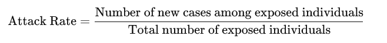
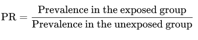
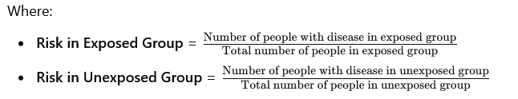

<script type="text/javascript"
  src="http://cdn.mathjax.org/mathjax/latest/MathJax.js?config=TeX-AMS-MML_HTMLorMML">
</script>

```{r style, echo=FALSE, message=FALSE, warning=FALSE, results="asis"}
suppressPackageStartupMessages({
 # library(BiocStyle)
  library(knitr)
  library(rmarkdown)
  library(bookdown)
})
options(width = 100)
opts_chunk$set(fig.width = 5, fig.height = 5)

```

```{r,echo=FALSE}
library(e1071)
library(lattice)
library(ggplot2)
library(mvtnorm)
library(tinytex)
```

# Introduction

## What is Epidemiology?

In our previous session, we gave several definitions of the term Epidemiology and expounded on the same. However, we narrowed down to this definition as our working definition for this class and beyond. That is; the study of [**frequency**]{.underline}**, [distribution]{.underline}** and [**determinants**]{.underline} of diseases and other [**health related conditions**]{.underline} in human [**population**]{.underline} and [**the application of this study to the promotion of health**]{.underline} and prevention or control of health problems.

-   **Population**: The main focus of epidemiology is on the effect of teh disease on the population rather than the individual. E.g. Malaria affects many people in western region of Kenya while Lung cancer is rare in the same region. If an individual develops Lung cancer, it is more likely that they will die. Even though lung cancer is a more killer disease, epidemiology gives more emphasis to malaria because if affects many people.

-   **Frequency:** This shows that epidemiology is mainly a quantitative science . Epidemiology is concerned with the frequency (occurrence)

-   **Health related conditions**: Epidemiology is concerned not only with disease but also with other health related conditions because every thing around us and what we do also affects our health Health related conditions are conditions which directly or indirectly affect or influence health These may be injuries, births, health related behaviors like smoking, unemployment, poverty etc

-   **Distribution:** Distribution refers to the geographical distribution of diseases , the distribution in time, and distribution by type of persons affected.

-   **Determinants:** Determinants are factors which determine whether or not a person will get a disease

-   **Application of these studies in the promotion of health** to prevent and control the health problems.

    NB: The whole aim of studying the [**frequency**]{.underline}**, [distribution]{.underline}** and [**determinants**]{.underline} of diseases is to identify effective disease prevention and control strategies.

## History of Epidemiology

-   Epidemiology is the cornerstone of public health, and informs policy decisions and evidence-based medicine by identifying risk factors for disease and targets for preventive medicine.

-   Epidemiologists help with study design, collection and statistical analysis of data, and interpretation and dissemination of results.

-   Epidemiology has helped develop methodology used in clinical research, public health studies and, to a lesser extent, basic research in the biological sciences

-   The Greek physician Hippocrates is known as the father of medicine, and was the first epidemiologist. Hippocrates sought a logic to sickness. He is the first person known to have examined the relationships between the occurrence of disease and environmental influences.

-   Hippocrates believed sickness of the human body to be caused by an imbalance of the four Humors (air, fire, water and earth “atoms”). The cure to the sickness was to remove or add the humor in question to balance the body. This belief led to the application of bloodletting and dieting in medicine.

-   The distinction between “epidemic” and “endemic” was first drawn by Hippocrates, to distinguish between diseases that are “visited upon” a population (epidemic) from those that “reside within” a population (endemic).

-   The term “epidemiology” appears to have first been used to describe the study of epidemics in 1802 by the Spanish physician Joaquín de Villalba in Epidemiología Española. Epidemiologists also study the interaction of diseases in a population, a condition known as a syndemic.

-   Dr. John Snow is famous for his investigations into the causes of the 19^th^ century cholera epidemics, and is also known as the father of (modern) epidemiology. He began by noticing the significantly higher death rates in two areas supplied by Southwark Company. His identification of the Broad Street pump as the cause of the Soho epidemic is considered the classic example of epidemiology. He used chlorine in an attempt to clean the water and had the handle removed, thus ending the outbreak. This has been perceived as a major event in the history of public health and regarded as the founding event of the science of epidemiology, having helped shape public health policies around the world. However, Snow’s research and preventive measures to avoid further outbreaks were not fully accepted or put into practice until after his death.

-   In the early 20^th^ century, mathematical methods were introduced into epidemiology by Ronald Ross, Anderson Gray McKendrick and others. Another breakthrough was the 1954 publication of the results of a British Doctors Study, led by Richard Doll and Austin Bradford Hill, which lent very strong statistical support to the suspicion that tobacco smoking was linked to lung cancer.

## Uses of Epidemiology

1.  To make a community diagnosis

2.  Epidemiology helps to identify and describe health problems in a community ( for example , the prevalence of anemia, or the nutrition status of children

3.  To monitor continuously over a period of time the change of health in a community. (for example, the effect of a vaccination programme, health education, nutritional supplementation).

4.  To practice surveillance for a specific disease in order to be able to act quickly and so cut short any outbreak (example cholera).

5.  To investigate an outbreak of a communicable disease, analyze the reasons for it, plan a feasible remedy.

6.  To plan effective health services. Effective services, interventions and remedies all depend on accurate community data

## Approaches in Epidemiology

**Descriptive Epidemiology** and **Analytical Epidemiology** are two fundamental approaches in the study of disease patterns and determinants in populations.

### **Descriptive Epidemiology**

Descriptive epidemiology focuses on summarizing and describing the distribution of diseases or health outcomes within a population. It answers the **"who, what, when, and where"** questions of disease occurrence.

**Key Characteristics:**

-   **Who** is affected (e.g., age, gender, occupation)?

-   **What** is the disease or health condition?

-   **When** does the disease occur (seasonality, time trends)?

-   **Where** is the disease occurring (geographical distribution)?

**Purpose:**

-   To identify patterns or trends in health-related conditions.

-   To generate hypotheses about possible causes of diseases.

-   To provide a basis for public health planning and resource allocation.

**Examples:**

-   The number of new HIV cases reported in a specific year in a particular country.

-   Age-specific death rates from cardiovascular disease in different regions.

### **Analytical Epidemiology**

Analytical epidemiology goes beyond description and focuses on understanding the **causes** and **determinants** of health outcomes. It aims to test specific hypotheses by determining **why** and **how** diseases occur.

**Key Characteristics**

-   **Why** is the disease occurring (risk factors)?

-   **How** is the disease spreading (transmission mechanisms)?

**Purpose**

-   To identify and quantify the relationships between exposures (e.g., risk factors, behaviors) and health outcomes.

-   To test hypotheses generated from descriptive studies.

-   To determine the effectiveness of interventions.

**Examples:**

-   Investigating whether smoking is associated with lung cancer by comparing smokers and non-smokers.

-   A study examining whether a new vaccine reduces the risk of a particular disease.

In descriptive studies, there are three characteristics of the disease that we that we look at. These include Person, Place and Time (PPT)

**Person**

An individuals characteristics can increase of decrease the risk for developing an illness. For example, the elderly and very young are often at elevated risk for bacterial and viral infections. Average (median), minimum, and maximum ages of cases, as well as proportions of cases according to sex and other relevant variables, should be part of any descriptive analysis. Cross-tabulations among these variables may be calculated to identify inter-relationships. Analyses of case demographics may provide insight into the source of an outbreak, for example, if the majority of cases are female, young or old, or from a specific ethnic group or religious community. In addition, the following should also be considered;

-   ethnic group

-   concurrent disease

-   diet, physical activity, smoking

-   risk taking behavior

-   socio-economic status

-   education

-   occupation

**Place**

The disease causing organisms do not necessarily respect or follow political borders in a country or region. Therefore, an examination of the ***spatial associations*** of cases can play a key role in determining the source of, say an outbreak. For example, the distribution of cases amongst constituencies in Nairobi County could be a reflection of the availability of contaminated food product that may have been distributed my say the county government or a politician. Thus, maps may be a useful tool in describing these spatial associations. Other factors to consider here include;

-   presence of agents or vectors

-   cliate

-   geology

-   population density

-   economic development

-   cultural practices

-   medical practices

**Time**

For us to be able to asses if disease incident rates or case numbers are changing, time is very important in characterizing the illness. Here, we need to consider the following;

-   calendar time

-   time since the event

-   age (time since birth)

-   seasonality

-   temporal trends

## Epidemiologic Approach

Just like any other scientific endeavor relies on a system of scientific approach, epidemiology does the same. In very simple terms, epidemiologists;

i.  count **cases** of health related events and describe the in terms of time, place and person.
ii. divides the number of cases by an *appropriate number* to calculate the **ratios** or **rates**
iii. compares these rates over time for different groups of people

**A [case]{.underline} in Epidemiology**

Before counting cases, an epidemiologist must decide on what to count i.e. what to call **a case**. Hence, an epidemiologist uses a **case definition**.

A *case definition is a set of standard criteria for classifying whether a person has a particular disease or symptom or other health condition*.

Some case definitions, particularly those use for national surveillance have been developed and adopted as **national standards that ensures comparability**.

The use of an agreed upon standard case definition ensures that every case is equivalent, regardless of when or where it occurred or who identified it. The number of cases or rate of diseases identified in the time or place can be compared with the number /rate for another time or place.

## Disease Causation

The cause of disease is an *event*, *condition*, *characteristic* or a ***combination*** of these factors which plays an important role in producing the disease

The causes of disease can be classified into two groups;

**Primary causes**

-   these are the factors which are necessary for a disease to occur, in whose absence the disease will not occur The term ”etiologic agent” can be used instead of primary cause for Infectious causes of diseases. For example “Mycobacterium tuberculosis” is the primary cause etiologic agent of pulmonary tuberculosis

**Risk factors**

-   these are the contributing, predisposing, or aggravating factors

-   they are not necessarily causes of a disease but are important for a disease to occur.

-   a factor associated with an increased risk of the occurrence of a disease is called a **Risk factor** for the exposed group, while a factor that is associated with decreased occurrence of a disease is known as a risk factor for the non-exposed group.

-   the etiology of a disease is the sub-total of all factors (primary causes and risk factors) which contributes to the occurrence of a disease.

## The epidemiologic triangle (triad)

For us to understand how diseases spread, it is essential for us to learn about diseases and how they move through populations, and what allows them to survive and thrive. In this way, epidemiologists effectively study and fight the spread of disease

The Epidemiologic Triangle (triad) is a model that scientists have developed for studying health problems. It is useful in understanding the how diseases spread, especially infectious diseases. The model is very simple and represents a high-concept, bird’s-eye view of infectious diseases.

Epidemiologic triangle is a model for explaining the organism causing the disease and the conditions that allow it to reproduce and spread.

The following figure illustrates the relationship among the three key factors in the occurrence of a disease (outcome).

{width="336"}

**Agent**

An agent is a factor whose absence or presence, excess or deficit is necessary for a disease to occur. This may be a biological factor or a chemical agent which influences the occurrence of a disease or its severity.

The agent is the microorganism that actually causes the disease in question. An agent could be some form of **bacteria, virus, fungus, or parasite**.

**Host**

Consists of personal traits (sex , race , age, occupation, nutrition, heredity, marital status) , behavior, genetics, predisposition and immunologic factors.

The agent infects the host, which is the organism that carries the disease. A host doesn’t necessarily get sick; hosts can act as carriers for an agent without displaying any outward symptoms of the disease. Hosts get sick or carry an agent because some part of their physiology is hospitable or attractive to the agent.

**Environment**

Includes external factors other than the agent that influence health. They include : temperature , humidity, altitude, water, radiation, pollution, housing conditions , Food/milk

These factors are further characterized as to whether they belong to **social**, **physical** or **biological** environments.

**Social environment** - encampuses a broad range of factors including *education, unemployment, culture, political practices, legal, economic, communication, transport and health care system*.

**Physical environment** - factors include physical environment

**Biological environment** - includes vectors, human beings e.t.c

**An Illustrative Example**

The following example can be used to explain the spread of existing diseases.

The HIV epidemic reached its height in 1985, when there were roughly 130,000 annual cases of infection. Since that time, reported annual infections have decreased dramatically, though the CDC estimates that there are currently around 1.2 million people in the United States living with HIV. By better understanding how HIV is communicated, epidemiologists were able to make progress on treatment and prevention.

**Agent**

HIV is a viral infection that targets a person’s immune system, making it more vulnerable to other forms of infection. Because the virus targets the immune system itself, the body cannot effectively fight HIV on its own. HIV is communicated through direct contact with an infected person’s bodily fluids, and it primarily spreads through sexual contact or shared needles.

**Host**

Scientists theorize that HIV was originally carried by chimpanzees and that humans who hunted these chimpanzees for meat became infected with a mutated form of the virus upon contact with the chimpanzees’ blood. HIV can be transmitted when a bodily fluid such as blood comes into contact with a mucous membrane or damaged tissue (such as an open wound or the mucous membranes found inside the mouth).

**Environment**

There are a number of socioeconomic factors that can impact the spread of HIV within a community. Communities with higher concentrations of sexually transmitted diseases and lower incidences of reporting — due to social pressure or otherwise — allow HIV to flourish. Poverty limits access to care and treatment, and discrimination can discourage individuals from being tested or seeking care.

*source:* <https://www.rivier.edu/academics/blog-posts/what-is-the-epidemiologic-triangle/>

***Note:*** From the perspective of this triangle, the host, agent and environment co-exist harmoniously. However, a disease or injury only occurs when there is altered equilibrium between them. Furthermore, epidemics occur when;

-   the host, agent and environment factors are not in balance

-   due to a new agent being introduced in the equation

-   due to change in an existing agent

-   due to change in the number of susceptible in the population

-   due to the environmental changes that affect transmission of the agent or growth of the agent

# Measures of Disease Frequency

## Introduction

A measure of central location provides a single value that summarizes an entire distribution of data. In contrast, a frequency measure characterizes only part of the distribution.

Frequency measures compare one part of the distribution to another part of the distribution, or to the entire distribution. Common frequency measures are ratios, proportions, and rates. All three frequency measures have the same basic form:

-   numerator/denominator \*10^n^

-   Recall that: 10^0^= 1 (anything raised to the 0 power equals 1)

-   10^1^ = 10 (anything raised to the 1st power is the value itself)

-   10^2^ = 10 x 10 = 100

-   10^3^ = 10 x 10 x 10 = 1,000

So the fraction of (numerator/denominator) can be multiplied by 1, 10,

100, 1000, and so on. This multiplier varies by measure and will be

addressed in each section.

So the fraction of (numerator/denominator) can be multiplied by 1, 10, 100, 1000, and so on. This multiplier varies by measure and will be addressed in each section.

## Measures of Frequency (Ratio, Proportion, Rate)

-   A comparison between the practice of **public health** and the more familiar practice of **health care** helps in describing **epidemiology**.

-   First, where health care practitioners **collect data** on an individual patient by taking a medical history and conducting a physical exam, epidemiologists **collect data about an entire population** through surveillance systems or descriptive epidemiological studies.

-   The health care practitioner uses his or her data to make a **differential diagnosis.** The epidemiologist's data is used to **generate hypotheses about the relationships between exposure and disease**.

-   **Both disciplines then test the hypotheses**, the health care practitioner by conducting additional **diagnostic studies or tests**, the epidemiologist by conducting **analytical studies** such as cohort or case-control studies.

-   The final step is to take action. The health care practitioner **prescribes medical treatment**, and the epidemiologist, some form of **community intervention to end the health problem and prevent its recurrence.**

# Morbidity measures in Epidemiology

Morbidity refers to the presence of **disease, injury, or disability** in a population. It can be measured in several ways, depending on the type of disease, its duration, and the population under study using various epidemiological tools.

These measures help assess the burden of diseases and guide public health interventions.

While there are many measures of morbidity, epidemiologists most often estimate the occurrence of disease in a population in terms of **incidence** or **prevalence** of a disease. The main difference between the two measures is the time of a the disease onset.

For incidence, it quantifies the development of disease and can be estimated using data from a disease registry or a cohort trial.

There is always the assumption of the period of time when talking about incidence, for example we could say **new cases within a month or a year**.

The summary incident rate can be used to estimate risk e.g probability of disease in an individual, if the risk is constant across summarized groups.

## Incidence

Incidence is the number of new cases of a disease that occur in a specific population during a defined time period.

### Incidence Rate

This is computed as 

**Example**: In a city of 100,000 people, 500 new cases of tuberculosis (TB) are diagnosed [**over a year**]{.underline}. The incidence rate of TB would be:

Incident Rate =


**Use**: Incidence is used to measure diseases that develop over time, such as infectious diseases (e.g., flu, tuberculosis) or chronic conditions like type 2 diabetes

### **Cumulative Incidence**

**Cumulative incidence** is a measure of the proportion of individuals in a population who develop a specific disease or condition over a defined period of time. It provides an estimate of the risk of developing the disease during the time period, focusing on new cases.

{width="582"}

Where:

-   **Number of new cases of disease**: The individuals who develop the disease during the specified time period.

-   **Population at risk**: The individuals who are initially free of the disease at the start of the period and are followed for the outcome.

**Example**

In a cohort of 1,000 individuals who are free of heart disease at the start of the year, 50 new cases of heart disease are reported at the end of the year.

**Cumulative Incidence Calculation**

CI=50/1000\*100 = 5%

**Interpretation**

The cumulative incidence of heart disease in this population over one year is **5%**, meaning that 5% of the population developed heart disease within that time period.

**Uses**

Cumulative incidence is useful for estimating the **risk** of disease in a closed population over a fixed period. It is often used in cohort studies and clinical trials to assess the development of new diseases or health outcomes.

### **Incidence Density (Incidence Rate)**

**Incidence Density** (also known as the **Incidence Rate**) is a measure in epidemiology that estimates the occurrence of new cases of a disease in a population over a specific amount of **person-time**.

Unlike [cumulative incidence]{.underline}, which is based on a fixed population over a period of time, incidence density accounts for varying periods of observation for each individual, making it useful when follow-up time differs across individuals in the population. This can be obtained as follows,

{width="461"}

Where:

-   **Number of new cases of disease**: The number of individuals who develop the disease during the observation period.

-   **Total person-time at risk**: The sum of the time each individual was at risk of developing the disease (e.g., years, months, or days of observation for each person).

**Note:**

-   **Person-time** is used when individuals are observed for different lengths of time. For example, some individuals may enter or leave the study at different points, or they may develop the disease (and no longer be at risk).

-   Incidence density is expressed as cases per unit of person-time (e.g., cases per 100 person-years).

-   This provides a dynamic measure of how fast new cases of disease occur in a population.

**Example**

In a study, 200 people are followed for varying amounts of time to observe the occurrence of a disease. The total observation time is 400 person-years (this accounts for the fact that some people were followed for longer than others). During this time, 40 new cases of the disease are recorded.

**Incidence Density Calculation**:

-   **Number of new cases** = 40

-   **Total person-time** = 400 person-years

    that is ID= 40/400 = 0.1 cases per person-year

**Interpretation**

The incidence density is **0.1 cases per person-year**, meaning that, on average, there were 0.1 new cases of the disease for each person followed for one year. Alternatively, this can be expressed as **10 cases per 100 person-years**.

**Uses**

Incidence density is particularly useful in studies where:

-   Individuals are followed for different lengths of time.

-   You want to understand the **rate** at which new cases occur in a dynamic population.

It is commonly used in clinical trials and cohort studies with long follow-up periods, or where participants enter and leave the study at different times.

## **Attack Rate**

-   Attack rate is a type of incidence rate, usually used during outbreaks, which measures the proportion of people exposed to a disease who become ill.

    {width="466"}

-   **Example**: In a group of 100 people who attended a party, 40 people developed food poisoning after eating contaminated food. The attack rate would be:

40 / 100 = 0.4 = 40%

-   **Use**: Attack rates are commonly used in outbreak investigations, such as during foodborne illness outbreaks or infectious disease outbreaks (e.g., measles).

We previously mentioned that a variety of attack rates can be calculated. That is

-   Overall attack rate is the total number of new cases divided by the total population.

-   A food-specific attack rate is the number of persons who ate a specified food and became ill divided by the total number of persons who ate that food, as illustrated in the previous potato salad example.

-   A secondary attack rate (SAR) is sometimes calculated to document the difference between community transmission of illness versus transmission of illness in a household, barracks, or other closed population.

-   SAR is defined as the number of exposed persons developing the disease within the range of incubation period following exposure to a primary case

**Secondary Attack Rate (SAR)**

The **Secondary Attack Rate (SAR)** is an epidemiological measure used to estimate the spread of a **contagious disease** within a defined group, such as a household, school, or other close-contact settings. It quantifies the proportion of susceptible individuals who become infected after exposure to a **primary case** (the first individual who contracted the disease).

{width="525"}

Where:

-   **New cases among contacts**: People who develop the disease after exposure to the primary case.

-   **Susceptible contacts**: People who were at risk of getting the disease (i.e., they have no immunity and were in close contact with the index case).

**Example: SAR Calculation in a Household**

Imagine there is an outbreak of influenza in a household. The first person to develop symptoms is identified as the **index case**. There are 5 other people in the household, all of whom are susceptible because none have been vaccinated or had prior exposure to the virus.

-   **Total susceptible contacts** = 5

-   During the outbreak, 3 of the 5 household members develop influenza after contact with the index case.

SAR = 3/5 \* 100 = 60%

**Interpretation**

In this household, the **Secondary Attack Rate** is **60%**, meaning 60% of the susceptible contacts were infected after being exposed to the index case. This suggests a relatively high transmission rate of influenza within the household setting.

**Use of SAR in Public Health**

Secondary attack rates are valuable in understanding the spread of infectious diseases within groups of people who have close, prolonged contact. This measure helps:

1.  **Estimate disease transmissibility** in different environments (e.g., households, schools, healthcare settings).

2.  **Evaluate the effectiveness of interventions** such as quarantining, isolation, vaccination, or antiviral treatment by comparing SARs before and after these measures are implemented.

3.  **Monitor the spread of new pathogens** (e.g., emerging infectious diseases) and assess the potential for an outbreak to spread among close contacts.

**Example of SAR Use During an Outbreak**

During the COVID-19 pandemic, SAR was commonly used to estimate how likely the virus was to spread within households or among close contacts. For instance, if an index COVID-19 patient infected family members, SAR provided a quantitative measure of within-household transmission, **guiding health authorities on isolation protocols and risk communication.**

## Prevalence

Prevalence is the total number of cases (both new and existing) of a disease present in a population at a [**given point in time**]{.underline} (point prevalence) or over a [**specified period**]{.underline} (period prevalence).

This is obtained as follows

Prevalence = Number of existing cases/total population at the same point in time

The term **prevalence rate** is often used instead of just prevalence. However, this is incorrect as by definition, prevalence is a proportion and not a rate.

**Example**: In a town with a population of 10,000, 700 people have hypertension. The prevalence of hypertension would be:

​700/10000=0.07 or 7%

**Use**:

Prevalence is particularly useful for measuring chronic conditions, such as heart disease or asthma, which tend to persist for longer periods.

There are two main types of prevalence: **point prevalence** and **period prevalence**. Each provides a different perspective on the burden of disease

### **Point Prevalence**

Point prevalence measures the proportion of a population that has a particular disease or health condition at a single point in time (like a snapshot).

{width="496"}

**Example**: If, on January 1st, 2024, there are 50 cases of asthma in a town of 5,000 people, the point prevalence of asthma is:

=50/5000 \* 100 = 1%

**Use**: Point prevalence is useful for diseases or conditions that persist over time, such as chronic conditions like diabetes or HIV, and can help measure disease burden at a specific moment.

### Period Prevalence

Period prevalence measures the proportion of a population that has a particular disease or condition at any time during a specified period (such as a week, month, or year).

{width="549"}

**Example**: If over the course of 2024, 200 people in a population of 5,000 experienced asthma at any point, the period prevalence of asthma would be:

= 200/5000\*100 = 4%

**Use**: Period prevalence captures both existing cases and new cases that develop during the period, and is useful for assessing diseases that fluctuate over time, like seasonal flu or allergies.

### Lifetime Prevalence

-   Lifetime prevalence refers to the proportion of a population that has had a particular disease or health condition at any point in their life up to the time of assessment.

**Example**: In a survey, if 10% of a population of 10,000 people reports having been diagnosed with depression at some point in their life, the lifetime prevalence of depression is **10%**:

**Use**: Lifetime prevalence is commonly used for mental health conditions or other chronic diseases to estimate the total burden of disease over an individual’s lifetime.

**Note:**

-   Each type of prevalence gives insights into the burden of disease depending on the **time frame considered**.

-   Point prevalence is ideal for **snapshot** measurements, period prevalence for assessing **disease over a given timeframe**, and lifetime prevalence for understanding the **total disease history in a population**.

-   These measures are crucial in planning and evaluating public health programs.

### Prevalence and incidence

Since prevalence counts both new and existing cases, the duration of the disease affects the prevalence of the disease. Diseases with long duration are ore likely to be prevalent than those with shorter duration. i.e chronic non-fatal conditions are more prevalent than conditions with high mortality. The prevalence of a disease is therefore directly related to the duration of the disease as follows;

Prevalence = incidence \* Duration

This can be visualized as follows

{width="406"}

### Computing incidence and prevalence

**Consider the following example**

The following **figure** represents 10 new cases of illness over about 15 months (October 1, 2004{September 30, 2005) in a population of 20 persons. Each horizontal line represents one person. The down arrow indicates the date of onset of illness. The solid line represents the duration of illness. The up arrow and the cross represent the date of recovery and date of death, respectively

{width="414"}

{width="644"}

## Case Fatality Rate (CFR)

CFR measures the proportion of individuals diagnosed with a particular disease who die from that disease within a specified period


**Example**: During an Ebola outbreak, 100 people were diagnosed, and 60 of them died. The CFR for Ebola would be:

60/100 \*100 = 60%

**Use**:

CFR is used to evaluate the severity of diseases, particularly for acute infectious diseases like Ebola or COVID-19.

### **Disability-Adjusted Life Years (DALYs)**

DALYs measure the total burden of disease, combining the years of life lost due to premature death (YLL) and the years lived with disability (YLD). One DALY equals one lost year of healthy life.

DALYs=YLL+YLD

**Example**: If 1,000 people suffer from a chronic disease like rheumatoid arthritis, leading to a loss of 5 years of healthy life on average, the burden in terms of DALYs would be calculated as:

DALYs=1,000×5=5,000 DALYs lost

**Use**

DALYs are commonly used to compare the burden of different diseases (e.g., comparing the burden of heart disease to that of HIV/AIDS) and to prioritize health interventions.

**Note**

Morbidity measures like incidence, prevalence, attack rate, CFR, and DALYs provide essential insights into the health status of populations, helping public health professionals monitor disease trends, plan interventions, and allocate resources

# **Measures of Association** and **Measures of Effect**

These two are key concepts in epidemiology, used to assess relationships between **exposures** (e.g., risk factors) and **outcomes** (e.g., disease). While they are related, they serve different purposes in epidemiological analysis.

In a previous session where we looked at assessing changes in rates, we discussed about the **absolute** and **relative** measures.

Any study aims to determine whether there is any risk (excess/reduced) of a certain **disease** in association with a certain **exposure**. To to this, we can look at either absolute or relative risks.

**Absolute Risk**

Consider the incidence of a **disease** in a population. This can indicate the magnitude of the risk in a group of people with a certain **exposure** but does not take into consideration the risk of a disease aimed at **un-diseased** population

**Relative Risk**

This is the probability of an event or of developing a disease occuring in exposed people compared to the probability of the event or developing a disease occurring in unexposed population.

## **Measures of Association**

Measures of association **quantify the strength** or degree of a relationship between an exposure and an outcome. They help determine whether and how much two variables are related. These measures include:

### **Prevalence Ratio (PR)**

This is used to compare the prevalence of a condition or disease between two groups at a single point in time. It is often applied in **cross-sectional studies**.

{width="323"}

**Example**

In a study, 20% of smokers and 10% of non-smokers are found to have chronic bronchitis. Obtain the prevalence ratio for the two groups and interpret your results

PR = 0.2/ 0.1 = 2

This means that smokers are **twice as likely** to have chronic bronchitis compared to non-smokers at a given time.

### **Risk Ratio (RR) (Relative Risk)**

The **Risk Ratio (RR)**, also known as **Relative Risk**, is a measure used to compare the risk of an outcome (such as a disease) over time between two groups: an **exposed group** and an **unexposed group**. It provides information on whether and how much the exposure increases or decreases the risk of the outcome. It is typically used in **cohort studies**.

This is computed as follows


{width="542"}

**Example: Smoking and Lung Cancer**

Imagine a cohort study that examines the relationship between smoking (exposure) and lung cancer (outcome). The study follows 1,000 smokers and 1,500 non-smokers for 10 years and records the number of people who develop lung cancer.

The results are as follows:

-   90 smokers develop lung cancer.

-   30 non-smokers develop lung cancer.

    **Solution**

First, display the information using a contingency table as follows


**Interpretation of RR = 4.5**

Smokers have 4.5 times the risk of developing lung cancer compared to non-smokers. This means smoking is associated with a significantly higher risk of lung cancer.

**Conclusion**

The **Risk Ratio** compares the risk of an outcome in exposed versus unexposed groups. In this example, a **Risk Ratio of 4.5** suggests that smokers are **4.5 times more likely** to develop lung cancer than non-smokers. This information is critical in public health for understanding the impact of risk factors like smoking and for developing targeted interventions to reduce disease burden.

Interpretation of the RR values obtained

-   **RR \> 1**: Exposure is associated with an increased risk of disease.

-   **RR = 1**: No difference in risk between exposed and unexposed groups.

-   **RR \< 1**: Exposure is associated with a decreased risk of disease (protective effect).

**Exercise (use contingency table)**

A study follows 100 people for 1 year. Among 50 smokers, 15 develop lung disease, while among 50 non-smokers, 5 develop lung disease.

### **Rate Ratio (RR), (Incidence Rate Ratio, IRR)**

The **Rate Ratio**, also known as the **Incidence Rate Ratio (IRR)**, is a measure of association used in epidemiology to compare the rate of occurrence of an event (typically a disease) in two different groups. It is commonly used in cohort studies and measures the relative difference in incidence rates between **exposed** and **unexposed** groups.

By definition rate ratio compares the incidence rate (***the number of new cases per unit of person-time***) in the **exposed** group to the incidence rate in the **unexposed** group. It quantifies how many times **higher** or **lower** the rate of disease is in the exposed group compared to the unexposed group.

{width="484"}

{width="582"}

**Interpretation**

Similar to the interpretation of the Risk Ratio, rate ratio is also interpreted as follows;

-   **RR = 1**: The incidence rates in both groups are the **same**, meaning there is no association between the exposure and the outcome.

-   **RR \> 1**: The incidence rate in the exposed group is **higher** than in the unexposed group, suggesting the exposure may increase the risk of disease.

-   **RR \< 1**: The incidence rate in the exposed group is **lower** than in the unexposed group, suggesting the exposure may protect against the disease.

**Example**

A study investigates the incidence of lung cancer in two groups: smokers and non-smokers, over 10 years. The study finds:

-   In smokers (exposed group), there are 150 new cases of lung cancer over 5,000 person-years.

-   In non-smokers (unexposed group), there are 30 new cases of lung cancer over 10,000 person-years.

{width="605"}

**Interpretation of RR = 10**

Smokers have 10 times the incidence rate of lung cancer compared to non-smokers, indicating a strong association between smoking and lung cancer.

**Use Cases**

-   **Cohort Studies**: Used to compare the incidence rates of disease between groups with different exposures.

-   **Public Health**: Helps quantify the impact of exposure (e.g., smoking, pollution) on disease incidence, guiding intervention strategies.

In Summary

The **Rate Ratio (RR)** is a useful epidemiological tool for comparing incidence rates between groups, indicating whether and how much an exposure increases or decreases the risk of disease. It is essential for understanding associations between risk factors and health outcomes, especially when considering time at risk in both exposed and unexposed groups.

**Exercise**

In a workplace exposure study, 30 new cases of a respiratory disease occur among 600 person-years of exposure, while 10 cases occur among 400 person-years of no exposure. Obtain the rate ratio and interpret your results.

**Odds Ratio (OR)**

Often used in case-control studies, comparing the odds of exposure in cases (with disease) to the odds in controls (without disease)

{width="323"}

Consider the following table

|               | Disease(+) | Disease(-) | Total       |
|---------------|------------|------------|-------------|
| **Exposed**   | a          | b          | **a+b**     |
| **Unexposed** | c          | d          | **c+d**     |
| **Total**     | **a+c**    | **b+d**    | **a+b+c+d** |

Where:

-   **a** = exposed with disease

-   **b** = exposed without disease

-   **c**= unexposed with disease

-   **d**= unexposed without disease

From the formula,

-   Odds of disease in **exposed** is obtained as **a/b**

-   Odds of disease in **un-exposed** is obtained as **c/d**

and therefore, OR = (a/b)/(c/d) = (a\**d)/(b*\*c)

**Example (with Contingency Table)**

A case-control study investigates the link between alcohol consumption and liver disease. Among 100 cases (with liver disease), 60 consumed alcohol. Among 100 controls (without liver disease), 30 consumed alcohol. Obtain the OR and interpret the results

|                | Disease(+) | Disease(-) | Total |
|----------------|------------|------------|-------|
| **Exposed**    | 60         | 30         | 90    |
| **Un-exposed** | 40         | 70         | 110   |

**Solution**

**OR** = 60\*70/30\*40 = 4200/1200 = **3.5**

This means that the **odds of liver disease** among those who consume alcohol is **3.5 times higher** than among those who do not consume alcohol.

**Summary**

-   **Prevalence Ratio**: Used in [cross-sectional]{.underline} studies to compare the prevalence of disease between groups at a single time point.

    -   Example: PR of 2 for chronic bronchitis in smokers vs. non-smokers.

-   **Risk Ratio**: Used in [cohort]{.underline} studies to compare the risk of disease between exposed and unexposed groups over time.

    -   Example: RR of 3 for lung disease in smokers vs. non-smokers.

-   **Rate Ratio**: Compares the incidence rate of disease between two groups considering the person-time of follow-up.

    -   Example: Rate Ratio of 2 for respiratory disease in an exposed vs. unexposed workplace group.

-   **Odds Ratio**: Used in [case-control]{.underline} studies to compare the odds of exposure in cases (diseased) vs. controls (non-diseased).

    -   Example: OR of 3.5 for liver disease in alcohol consumers vs. non-consumers.

Each measure serves different study designs and offers unique insights into the association between exposure and disease.

**Class Exercise**

-   Consider the following hypothetical data from a follow-up study of 10000 individuals for a period of 10 years. Compute the relevant measures of association and comment on your results

|                          | Exposed | Un-exposed |
|--------------------------|---------|------------|
| Number initially at risk | 2000    | 8000       |
| Deaths                   | 15      | 30         |
| Person-years at risk     | 3985    | 15970      |

-   A study found out that menopause affects the rate of heart disease in women. Based on the following data, obtain the rate ratio and comment on your results

|                 | Cases | person-years at risk |
|-----------------|-------|----------------------|
| Post menopausal | 13    | 3424                 |
| Pre-menopausal  | 3     | 4192                 |

## **Measures of effect (Difference measures)**

Measures of effect quantify the actual **impact** of an exposure on the occurrence of an outcome. They focus on how much of the disease can be **attributed** to the exposure, providing information on the **public health impact** of eliminating or controlling the exposure.

These measures estimate the excess risk caused by the exposure to the exposed group

These measures include;

### **Risk Difference (RD)**

-   Also known as the **Attributable Risk**, is an epidemiological measure that quantifies the absolute difference in the **risk** of a disease or outcome between two groups (typically, an exposed group and an unexposed group).

-   It tells us how much additional risk of the outcome is due to the exposure, thus helping in the assessment of the public health **impact** of an exposure.

**RD**=Risk in the exposed group − Risk in the unexposed group

Where:

**Risk** is the proportion of individuals in a group who develop the disease during a specific period, usually expressed as a probability (number of cases divided by the total population at risk).

**Interpretation**

-   **RD = 0**: No difference in risk between the exposed and unexposed groups.

-   **RD \> 0**: The exposure is associated with an increased risk of disease (i.e., harmful exposure).

-   **RD \< 0**: The exposure is associated with a decreased risk of disease (i.e., protective exposure).

**Example of Risk Difference**

A study examines the risk of developing heart disease among smokers and non-smokers over 10 years:

-   **Risk in smokers**: 20% (0.20) of smokers develop heart disease.

-   **Risk in non-smokers**: 5% (0.05) of non-smokers develop heart disease.

**Calculation**

RD=0.20−0.05=0.15

**Interpretation**

The **RD** of 0.15 (or 15%) indicates that **15% more** people in the smoking group developed heart disease compared to the non-smoking group. This implies that the [exposure to smoking contributes to an additional 15 cases of heart disease per 100 individuals over the study period.]{.underline}

**Public Health Relevance**

**Risk Difference** is especially useful for:

1.  **Measuring public health impact**: RD gives an absolute estimate of the burden of disease due to an exposure. A high RD suggests that the exposure is causing a significant number of additional cases, which could inform targeted interventions.

2.  **Assessing the effect of removing an exposure**: By calculating the RD, we can estimate how many cases of a disease could be prevented if the exposure were eliminated.

**Example of Risk Difference in disease prevention**

In a population of 1,000 people, the risk of lung cancer among smokers is 0.15 (15%), while in non-smokers, it's 0.02 (2%). The **RD** between smokers and non-smokers is:

RD=0.15−0.02=0.13

This means **13% of lung cancer cases** could potentially be prevented if no one in the population smoked. This could help public health officials quantify the impact of smoking cessation programs.

**Risk Difference vs. Risk Ratio**

-   **Risk Difference (RD)** gives an [absolute]{.underline} measure of the impact of an exposure on disease occurrence, answering the question: "How many more cases of the disease occur due to the exposure?"

-   **Risk Ratio (RR)** is a [relative]{.underline} measure and answers the question: "How much more likely is the disease to occur in the exposed group compared to the unexposed group?"

### **Attributable Fraction (AF)**

**Attributable Fraction (AF)**, also known as the **Attributable Proportion** or **Attributable Risk Percent** or **Attributable Fraction for exposed** or **Etiological Fraction among exposed**, is an epidemiological measure that quantifies the proportion of cases (or disease burden) in an exposed population that can be attributed to a specific exposure.

Assuming causal association, it is the proportion of risk or incidence in the exposed group that is **due to the exposure**.

The AF is particularly useful for determining the **public health impact** of eliminating the exposure, showing how much of the disease could be prevented if the exposure were removed.

Computing Attributable Fraction in the Exposed (AFexposed​)

{width="515"}

Where:

-   **Risk in exposed** is the probability of the disease in the exposed group.

-   **Risk in unexposed** is the probability of the disease in the unexposed group.

-   **RR** is the Risk Ratio (Relative Risk).

**Interpretation**

-   The **Attributable Fraction** tells us the **proportion of cases** among the exposed population that can be attributed to the exposure.

-   For example, an AF of 40% means that 40% of cases in the exposed group are attributable to the exposure, implying that if the exposure were eliminated, 40% of the cases could potentially be prevented.

**Example**

Suppose a study finds that 30% of smokers develop lung cancer over a period, while 5% of non-smokers develop lung cancer. We can calculate the **Attributable Fraction** to estimate how much of the lung cancer in smokers is due to smoking.

-   Risk in exposed (smokers) = 0.30 (30%)

-   Risk in unexposed (non-smokers) = 0.05 (5%)

-   Risk Ratio (RR) =0.3/0.05 = 6

{width="508"}

**Interpretation**

In this example, the **Attributable Fraction** of 83.33% means that **83.33% of lung cancer cases among smokers** can be attributed to smoking. If smoking were eliminated, we could expect to prevent 83.33% of lung cancer cases in the smoker population.

Other measures may include

**Population Attributable Risk (PAR)**

The proportion of the disease in the entire population that can be attributed to the exposure.

{width="398"}

**Population Attributable Fraction (PAF)**

PAF is a related measure that estimates the proportion of all cases in the total population (both exposed and unexposed) that can be attributed to the exposure. It is useful for assessing the **public health impact** of an exposure on the entire population, not just those exposed. It is obtained as follows

{width="322"}

Where:

-   P~e~ is the proportion of the population that is exposed.

-   **RR** is the Risk Ratio (Relative Risk).

**Uses of Attributable Fraction**

1.  **Public Health Planning**: The AF provides insights into how much disease could potentially be reduced by removing an exposure, aiding in setting priorities for interventions.

2.  **Quantifying Preventive Potential**: It helps estimate the impact of preventive strategies aimed at eliminating or reducing the exposure.

3.  **Communicating Risk**: AF simplifies communication of the impact of an exposure, offering a clear percentage of cases directly attributable to the exposure

### Vaccine Efficacy (VE)

Vaccine Efficacy is a measure used to quantify the **protection** a vaccine provides against a specific disease in a [controlled research setting]{.underline}, such as a [clinical trial]{.underline}.

It estimates the [percentage]{.underline} reduction in the risk of developing the disease among **vaccinated** individuals compared to **unvaccinated** individuals.

VE is important for evaluating **how well** a vaccine works and is often used in clinical trials to demonstrate the effectiveness of a new vaccine.

The formula for calculating vaccine efficacy is based on the **Risk Ratio (RR)**/ **Rate Ratio** between vaccinated and unvaccinated groups

{width="667"}

Alternatively, **VE = (1- RR)\*100**

Where:

-   **Risk (Rate) in unvaccinated group** is the incidence (or attack rate) of the disease among those who did not receive the vaccine.

-   **Risk(Rate) in vaccinated group** is the incidence (or attack rate) of the disease among those who received the vaccine.

-   **RR** is the Risk Ratio (rate Ratio), which is the risk of disease in the vaccinated group divided by the risk in the unvaccinated group.

**Interpretation**

-   **VE = 100%**: The vaccine provides complete protection, meaning no cases of the disease occur in the vaccinated group.

-   **VE = 0%**: The vaccine provides no protection, meaning there is no difference in disease occurrence between vaccinated and unvaccinated individuals.

-   **VE \> 0%**: The vaccine provides some level of protection, with higher values indicating greater efficacy.

-   **VE \< 0%**: The vaccine increases the risk of the disease, indicating that it may have adverse effects.

    **Example**

    In a clinical trial, researchers study the efficacy of a new vaccine against a virus. The incidence of the virus over one year is:

    -   **Risk in unvaccinated group**: 10% (0.10) of individuals get the virus.

    -   **Risk in vaccinated group**: 2% (0.02) of individuals get the virus.

{width="526"}

**Interpretation**

In this example, the **Vaccine Efficacy** of 80% means that the vaccine reduces the risk of developing the virus by 80% in vaccinated individuals compared to those who are unvaccinated.

**Vaccine Efficacy vs. Vaccine Effectiveness**

-   **Vaccine Efficacy** is typically measured in clinical trials under controlled conditions, where the participants are closely monitored, and ideal storage and administration protocols are followed.

-   **Vaccine Effectiveness** refers to how well a vaccine performs in real-world settings, where factors such as compliance, variations in storage conditions, and individual behavior may affect outcomes.

**Uses of Vaccine Efficacy**

-   **Public Health Planning**: VE is critical for determining the potential impact of a vaccination program on a population level.

-   **Vaccine Approval**: VE is a key measure used in the regulatory approval of vaccines.

-   **Risk Communication**: VE provides a straightforward way to communicate how much protection a vaccine offers against a disease.

**Exercise**

In a study of Cholera vaccine, the rate of developing Cholera was estimated among those receiving a vaccine and those receiving a placebo. The table below summarizes the numbers. Compute the vaccine efficacy and interpret your results

|         | Cases | Person -Years | Rate per 100 p-years |
|---------|-------|---------------|----------------------|
| Placebo | 90    | 903           | 10                   |
| Vaccine | 17    | 847           | 2                    |

## **Key differences between measures of association and measures of effect**

+--------------+---------------------------------------------------------------+--------------------------------------------------------------------------------------+
| Aspect       | Measure of association                                        | Measure of effect                                                                    |
+==============+===============================================================+======================================================================================+
| **Focus**    | **Strength** of the relationship between exposure and outcome | **Impact** or contribution of exposure to the occurrence of disease                  |
+--------------+---------------------------------------------------------------+--------------------------------------------------------------------------------------+
| **Purpose**  | Determine if and how strongly exposure is linked to disease   | Estimate how much of the disease is caused by the exposure                           |
+--------------+---------------------------------------------------------------+--------------------------------------------------------------------------------------+
| **Examples** | Relative Risk (RR), Odds Ratio (OR)                           | Risk Difference (RD), Attributable Fraction (AF), Population Attributable Risk (PAR) |
+--------------+---------------------------------------------------------------+--------------------------------------------------------------------------------------+
| **Use**      | Understanding relationships for epidemiological hypotheses    | Guiding public health interventions and policy decisions                             |
+--------------+---------------------------------------------------------------+--------------------------------------------------------------------------------------+

# Introduction to epidemiological study designs

## Exposures and Outcomes

Before looking at the study designs used in epidemiological research, we need to consider what is being studied. In an epidemiological study, there is;

\- the [**primary exposure**]{.underline} (or risk factor f interest)

\- [**other exposures**]{.underline} or risk factors that may influence the outcome of interest (aka potential confounders)

\- the [**outcome**]{.underline} of interest

## An exposure

As previously mentioned, in epidemiology, the term exposure is used in a very broad sense. It is not limited to an environmental hazard such as air pollution or a chemical but may be something as simple as age! An exposure therefore refers to **any factor** that **may influence** the health status or outcomes of a population.

An exposure may even be a genetic factor such as a blood group or a sickle cell trait.

The primary exposure of interest is therefore the one which is included in the hypothesis.

For example:

-   If the hypothesis is that **aflatoxin**[^1] causes liver cancer, then aflatoxin is the **primary exposure** of interest in this case.

-   On the other hand, if the hypothesis is that an **individuals ability** to metabolize aflatoxin determines the risk of liver cancer, then the metabolic enzyme phenotype/genotype is the **primary exposure** of interest.

[^1]: **Aflatoxins are a family of toxins produced by certain fungi that are found on agricultural crops such as maize (corn), peanuts, cottonseed, and tree nuts**

There may also be more than one exposure, for example; if a study has been set up to examine the hypothesis that alcohol is a cause of liver cancer **independent** of smoking, the one clearly has to measure smoking exposure as well as alcohol consumption. In this case, smoking is a [**potential confounder**]{.underline} as it "may get in the way" when studying the relationship of alcohol consumption and lung cancer.

However, awareness of the existence of confounding is crucial to any discussion of epidemiological studies. Indeed, many of the study designs in epidemiology **are built around the control of confounding**. Briefly, for a factor to be regarded as a confounder, the rules are;

1.  the factor **must be associated** with the exposure of interest being investigated.

2.  the factor **must independently be associated** with the risk of developing the outcome of interest.

For example;

In a study of alcohol and lung cancer, an association was observed between high alcohol intake and the risk of lung cancer, then the association may in-part (or wholly) be due to the fact that people with high alcohol consumption are more likely to be smokers (and smoking is a risk factor of lung cancer). Thus, in assessing the relationship between lung cancer and alcohol, smoking would be taken into account.

In this context, smoking is considered to be a confounding factor (a confounder) . In a diagram, this is expressed as follows;

{width="349"}

Exposures can include environmental factors, lifestyle choices, infectious agents, and more. Here are a few common examples:

1.  **Tobacco Smoking**: Exposure to cigarette smoke, either through active smoking or secondhand smoke, is a well-studied exposure linked to various health outcomes, such as lung cancer, heart disease, and respiratory conditions.

2.  **Air Pollution**: Exposure to pollutants like particulate matter (PM2.5), nitrogen dioxide (NO₂), and sulfur dioxide (SO₂) in the air can affect respiratory and cardiovascular health. Studies often examine populations in high-pollution areas to assess the impact of air quality on health.

3.  **Physical Activity**: Levels of physical activity can be considered an exposure in studies examining associations between exercise and health outcomes, such as obesity, diabetes, and cardiovascular disease.

4.  **Dietary Habits**: Dietary patterns, such as high sugar or salt intake, vegetarianism, or the Mediterranean diet, are exposures that can influence the risk of chronic diseases like diabetes, hypertension, and cancer.

5.  **Exposure to Infectious Agents**: Being in contact with a specific pathogen (e.g., the influenza virus, tuberculosis bacteria, or SARS-CoV-2) is considered an exposure when studying the spread of infectious diseases or immunity development.

6.  **Occupational Hazards**: Exposures to certain chemicals, noise, or repetitive motion in the workplace are often studied in occupational health to assess risks of conditions like hearing loss, musculoskeletal disorders, or chemical toxicity.

## An outcome

The term outcome as used in epidemiology is also a broad term. At times, we refers to this as **disease** but implies several outcomes.

Death is an easily defined and important outcome. A specific disease or event a state of health may also be defined as an outcome in a study. In some studies, there are multiple outcomes, just as we also saw that it is possible to have multiple exposures.

For instance, in a study of malaria, the outcomes could be **asymptomatic infection**; **fever with positive blood slide** and/or **cerebral malaria**. In these definitions, the degree of severity is an important component to help in distinguishing the definitions.

Note: A final point to note here is that a factor may be an outcome in one study and an exposure in another study. For instance, low birth weight (lbw) (bw \<2500gm) can be an outcome of interest in a study investigating determinants of poor foetal growth, and it can be the primary exposure in another study investigating the effect of poor foetal growth on mortality later in life.

## Study designs

The first step in an epidemiological design is to define the hypothesis that you wish to test. This should be done in a way that makes clear what the primary exposure, the outcome and the potential confounders in the study are. **One most then choose the most appropriate design**

**A study design is a structure which guides the way in which a study is conducted.** Each study design has its own internal logic and is suited for various types of **research questions**. To appreciate the variety of study designs and their varied uses one would have to revisit why anyone would want to conduct an epidemiological study.

Thus, one would conduct an Epidemiological Study in order:

-   To describe health and ill-health (disease) conditions in a comprehensive manner, that is;

    -   What is the disease, how does it manifest, what is it’s progression and prognosis

    -   Who gets the disease (which groups of people)

    -   Where does it occur (in which area is it more common or more severe)

    -   When does it occur (is it seasonal, has it changed over time)

-   To assess if there is an association with an exposure and an ill-health condition;

    -   Does an exposure (smoking, bacteria) cause a disease

    -   Does an exposure (vaccination, diet) prevent a disease

    -   Does an exposure improve/cure (insulin, antibiotic) a disease

The various study designs were then each developed to **accomplish one or more of the above objectives**. However there are **two broad categories** of epidemiological studies. Epidemiological studies can be either:

1.  Observational studies

2.  Intervention Studies

This can be represented in a diagrammatic format as follows

{width="433"}

### Observational studies

In **observational studies** the researcher merely observes things (e.g. being exposed to contaminated drinking water) that have occurred amongst a group and then (almost always) compares them to another group without that occurrence (e.g. had uncontaminated drinking water) and then checks if that thing (contaminated drinking water in this example) might have been responsible for different levels of disease (e.g. gastroenteritis in this example) or different levels of good health.

Simply put, these studies collect information on events which we have no control over. We are simply observing what is happening or what happened in the past.

A useful way to classify observational studies is to first group them into those where data is collected from **populations or groups (aggregated data)** andthose where data is collected from **individuals**. Further, we could also split the designs into those where the outcome of interest is described with no reference to the exposure (**descriptive studies)** and those where exposure and its association with the outcome of interest is considered (**analytical studies**).

Although this is a useful way to classify studies, sometimes there may be an overlap. For instance, some cross-sectional and cohort studies may be **both descriptive and analytical** as shown in the diagram (with dotted lines).

#### Descriptive studies using grouped/aggregated data

These studies examine disease/outcome occurrence by age, sex region, time period (person, place and time).

No exposure is determined in theses studies and they often make use of routinely collected data such as National Mortality or, say cancer incidence rates.

#### Ecological studies

An **ecological study** is a type of observational study design used in epidemiology to examine the relationships between exposures and outcomes at the **population or group level** rather than at the individual level.

These studies describe disease (outcome) in the population or groups as show in the diagram, but also include information on the exposure. The studies are therefore **analytical** in nature.

The average (or other summary) statistic is plotted for the exposure against the rate/outcome of that population.

This is done for several populations and the data are examined for evidence of an association between exposure and the outcome.

This study design is often useful for generating hypotheses, especially in situations where individual-level data may be challenging to obtain.

{width="514"}

**Key Features of Ecological Studies**

1.  **Group-Level Data**: In ecological studies, data on exposures and outcomes are collected and analyzed for groups (such as countries, cities, schools, or communities) rather than individuals. For instance, you might look at the average dietary intake of sugar in different countries and correlate it with national rates of diabetes.

2.  **Ecological Fallacy**: This is a common limitation of ecological studies. It occurs when assumptions about individual-level associations are made based on group-level data. For example, if a country has high average alcohol consumption and high rates of liver disease, it does not mean that individuals who drink more alcohol are necessarily the ones with liver disease.

3.  **Uses of Ecological Studies**

    -   **Hypothesis Generation**: They are often used as preliminary studies to identify potential associations that can be explored in more detailed individual-level studies.

    -   **Policy and Public Health Planning**: They help inform policies by identifying trends in exposures and outcomes at a population level, which can aid in public health interventions.

    -   **Large-Scale Associations**: Ecological studies are useful for studying exposures that are not feasible to measure at the individual level (e.g., air pollution levels across a city).

4.  **Strengths**

    -   Despite their weaknesses, ecological studies are useful because they can be carried out easily, quickly and inexpensively using data that are generally already available. If interesting and strong associations are observed, the results of ecological studies can provide the opportunity for later, more carefully designed studies (though more expensive and time-consuming) to build on the initial observations.

5.  **Limitations**

    -   **Confounding**: There may be unmeasured factors that influence the association at the group level.

    -   **Lack of Individual-Level Data**: Associations found at the group level may not hold true for individuals within those groups, which limits the ability to draw conclusions about cause and effect.

    -   The variables in ecological studies do not represent characteristics of individuals, but are summary measures, at group level, of the characteristics of many individuals (for example the summary measures of the prevalence of CVD and the average salt consumption).

**Example of an Ecological Study**

**Study Objective**: Investigate the association between average sodium intake and hypertension prevalence across different countries.

**Method**

-   **Data Collection**: Collect data on average daily sodium intake from dietary surveys conducted in various countries. Simultaneously, obtain data on hypertension prevalence from national health statistics or WHO data.

-   **Analysis**: Compare the average sodium intake with the hypertension prevalence across countries to see if there’s a correlation.

**Findings**

-   Suppose the study finds that countries with higher average sodium intake also have higher rates of hypertension.

**Interpretation**

-   This association may suggest that high sodium intake could be a risk factor for hypertension at the population level. However, further individual-level studies would be needed to confirm the relationship and understand individual susceptibility.

**Considerations**

-   **Ecological Fallacy**: Even if countries with high sodium intake show high hypertension rates, not all individuals in these countries consume high levels of sodium, nor do they all have hypertension.

-   **Confounding Variables**: Other factors, such as physical activity levels, dietary patterns, healthcare access, and genetic factors, might also influence hypertension prevalence.

**Note**: It is important to understand that the only conclusion one can draw from these studies relates to the population . *It is therefore not possible from an ecological study to draw conclusions about exposure in the individual and the risk of the outcome.* Attempting to do this will result in what we call [**ecological fallacy**]{.underline}.

**In summary**

Ecological studies provide valuable insights into population-level patterns and associations and are often used in public health research and policy-making. However, they should be interpreted cautiously, especially when considering their limitations, such as the potential for **ecological fallacy** and confounding.

**Task – Thinking critically about ecological studies**

According to Durkheim, in 19th century Europe, suicide rates were higher in countries that were more heavily Protestant. In his seminal monograph "The Suicide", the French scholar Emile Durkheim used this observed association to conclude that suicide was promoted by the social conditions of Protestantism[^2]. This conclusion was later criticised widely. **Can you think of any reason why this conclusion could be misleading**?

[^2]: Durkheim, E. (1897). Le suicide. Paris: F. Alcan. English translation by J A Spalding (1951). Toronto, Canada: Free Press/Collier-MacMillan.

#### Cross-sectional studies

A **cross-sectional study** is a type of observational study design in epidemiology where researchers collect data on exposure(s) and outcome(s) at a single point in time, or over a very short period, from a defined population.

This type of study provides a **"snapshot"** of the health status or characteristics of a population, making it useful for assessing the **prevalence** of diseases or conditions.

There are two types of cross-sectional studies


Descriptive cross-sectional studies answers questions like: **What is the prevalence of blindness in the Kenya?**

In desriptive studies, the prevalence of the outcome can be measured without reference to the exposure, for instance;

"the percentage % of JKUAT students suffering from headache on a particular day"

**or** the prevalence of exposure may be measured without reference to the disease or outcome.

"the % persons under 18 years in Nairobi who have used illegal drugs in the past"

These studies are classified as descriptive because the outcome is **not** reported in relation to the exposure or the exposure is **not** reported in relation to the outcome. This can be illustrated by the following diagram;

{width="381"}

However, if the prevalence of disease is measured in those with and those without he expensive of interest then the study is classified as analytical.

{width="415"}

Analytical studies answers questions such as: **What is association between gender and prevalent blindness in the Kenya?**

Cross-sectional studies are relatively simple to conduct and takes only a short time and are relatively cheap. For this reason, they are frequently used for planning purposes. However, they have the major drawback that the can be difficult to interpret as its not possible to know whether the outcome followed the exposure in time or the exposure resulted fro the outcome.

{width="421"}

**Key Features of Cross-Sectional Studies**

-   **Single Point in Time**: Data on both the exposure and outcome are collected simultaneously, making it impossible to determine causality. Instead, cross-sectional studies measure the prevalence of an outcome or exposure.

-   **Prevalence Measurement**: Cross-sectional studies are often used to estimate the prevalence of diseases, behaviors, risk factors, or health conditions in a population. This can provide important public health information, such as the percentage of a population that smokes, has diabetes, or is obese.

-   **Population-Based**: Cross-sectional studies can be conducted on entire populations, random samples, or specific subgroups. If the sample is representative, the results can be generalized to a broader population.

-   **Efficiency**: These studies are generally quicker and less expensive than longitudinal studies, as they require only one set of data collection.

-   **Limitation - Temporal Ambiguity**: Since exposure and outcome are measured simultaneously, it’s unclear whether the exposure preceded the outcome or vice versa. This limits the ability to draw causal inferences.

**When to Use Cross-Sectional Studies**

-   **Estimating Prevalence**: When the main goal is to determine how common a condition or behavior is within a population.

-   **Exploring Associations**: They can reveal potential associations between exposure and outcome, although these are not causative.

-   **Public Health Planning**: Useful for identifying risk factors and determining where to allocate public health resources.

-   **Generating Hypotheses**: Can be used as a basis for further longitudinal studies that investigate causation.

**Example: Cross-sectional study**

**Objective**: Assess the prevalence of hypertension and its association with obesity in a community.

**Method**:

-   **Population Selection**: Randomly select a sample of adults from a community.

-   **Data Collection**: At a single clinic visit, measure each participant’s blood pressure and body mass index (BMI).

-   **Analysis**: Calculate the prevalence of hypertension and obesity. Then, analyze whether hypertension is more common among individuals who are obese.

**Findings**

-   Suppose the study finds that 25% of the participants have hypertension and that hypertension is more common among individuals with obesity.

**Interpretation**:

-   This cross-sectional study provides data on how common hypertension is in this community and suggests an association between hypertension and obesity. However, since it’s cross-sectional, it cannot prove that obesity causes hypertension.

-   **Schizophrenia** will often result in an inability to hold down a job or may impair the ability of the person to hold a responsible job.

    In this situation cross-sectional studies might show that people with this disease have low economic status. This could be misinteprated as being in a lower social class increases the risk of **Schizophrenia** when in fact the occupational status was determined by the disease.

In reality one would not use cross-sectional study to examine this question because the disease is too uncommon. Meaning, it would be necessary to survey a very large population in order to have sufficient people with the outcome to draw any conclusion. Therefore, cross-sectional surveys are used to estimate the prevalence of common conditions of a reasonably long duration or to determine the distribution of continuous variables within a population.

Here is a good picture illustrating the example above

{width="357"}

3.  A cross-sectional study was conducted among 1,000 factory workers to examine the prevalence of respiratory disease in relation to smoking status. Out of the 1,000 workers:

-   400 are smokers, and among them, 120 have respiratory disease.

-   600 are non-smokers, and among them, 90 have respiratory disease.

    **a. Calculate the prevalence of respiratory disease among smokers.**

    {width="593" height="81"}

    **b. Calculate the prevalence of respiratory disease among non-smokers.**

    {width="648"}

    **c. Calculate the prevalence ratio** to compare the prevalence of respiratory disease between smokers and non-smokers.

    {width="555"}

    **d. Interpret the prevalence ratio** in the context of this study.

    The prevalence ratio of 2.0 suggests that the prevalence of respiratory disease among smokers is **twice as high** as it is among non-smokers in this population of factory workers. This indicates a possible association between smoking and respiratory disease, but [**causality cannot be determined from a cross-sectional study**]{.underline}.

**Advantages of Cross-Sectional Studies**

-   **Quick and Cost-Effective**: Typically easier and less costly than studies requiring multiple follow-ups.

-   **Useful for Prevalence Data**: Provides valuable information on the current state of health or risk factors in a population.

-   **Good for Multiple Outcomes**: Can simultaneously assess several outcomes and exposures.

-   Relatively easy to analyse

**Disadvantages of Cross-Sectional Studies**

-   **No Causality**: Temporal ambiguity prevents determination of cause-and-effect relationships.

-   **Susceptibility to Bias**: Selection bias and recall bias (if self-reported data is used) can influence results.

-   **Cannot Measure Incidence**: Only prevalence is measured, which doesn’t reflect new cases over time.

**Exercise**

A researcher conducts a cross-sectional study to investigate the relationship between physical activity and mental health among university students. The researcher surveys a random sample of students and collects data on the number of hours each student spends on physical activity per week and their mental health status (measured through a validated questionnaire).

1.  What type of information can the researcher obtain from this cross-sectional study?

2.  What are two advantages of using a cross-sectional study design for this research?

3.  Identify two limitations of this study design and explain how these limitations might affect the interpretation of the results.

4.  If the study finds an association between higher physical activity and better mental health, can the researcher conclude that physical activity improves mental health? Why or why not?

#### Cohort studies

**What is a cohort?**

A cohort is a group of persons (animals) with a common characteristic within defined time period. e.g. people born at the same time, period e.t.c.

Some of the types of cohorts include

-   birth cohort

-   exposure cohort

-   marriage cohort

A **cohort study** therefore is an observational study design in epidemiology where a group of people (or "cohort") is followed over time to observe how **exposure** to certain factors influences the development of specific **outcomes**.

Cohort studies allow researchers to study the incidence and risk of disease, providing valuable insights into causal relationships between **exposures** and **outcomes**

The starting point of a cohort study is the definition of a group of people by their exposure status. For example, one might take a group of smokers and a group of non-smokers. These are followed up for a period of time to see which ones develop a disease/condition such as **gangrene of the leg or requiring an amputation.**

There are **two** main types of cohort studies. These are

##### **Prospective cohort study**

-   It is a type of cohort study where researchers start with a group of individuals who are free of the outcome of interest and then follow them forward in time to see how certain exposures affect the risk of developing that outcome.

-   The following two diagrams illustrate the prospective cohort study design

    {width="363"}{width="294"}

    **Steps in conducting a prospective cohort study**

    -   **Define the study population**

        -   Identify a group of individuals who share common characteristics but who vary in exposure status.

        -   For example, this could include a group of smokers and non-smokers who are initially free of lung cancer.

    -   **Baseline data collection**

        -   At the beginning of the study, participants are assessed for various characteristics, including their **exposure status**, demographic information, and potential confounding factors.

        -   Exposure information may include lifestyle behaviors (e.g., smoking, diet), environmental factors (e.g., pollution, occupational exposure), or biological markers (e.g., cholesterol levels, blood pressure).

    -   **Defined cohort**

        -   The cohort consists of individuals who share a specific characteristic or set of characteristics, such as people living in a particular region, workers in a specific industry, or individuals with a similar health status.

        -   Participants must be free of the outcome of interest (e.g., disease) at the beginning of the study to ensure that exposure precedes the outcome.

    -   **Follow-up period**

        -   The cohort is followed over a specified period, **often years or even decades**, to monitor the occurrence of new cases of the outcome. This period can vary based on the study's objective and the anticipated time it might take for the outcome to develop. This is based on prior knowledge of the natural history of the disease

        -   During follow-up, researchers collect updated **exposure** information and monitor for the outcome of interest, such as the incidence of a disease or health event. If the disease (e.g. tuberculosis) over time develops more frequently amongst the exposed group (e.g. living in an over-crowded house) than amongst the unexposed group (don’t live in an over-crowded house) then the exposure might be causing the disease. The proportion of people who develop the disease over time is referred to as the *incidence* of disease

    -   **Outcome assessment**

        -   Throughout or at the end of the follow-up period, researchers assess the incidence of the outcome (e.g., development of disease, death) among participants.

        -   This can involve periodic health assessments, medical record reviews, or self-reported surveys, depending on the outcome and the study's design.

    -   **Temporal sequence**

        -   Because exposure is measured before the outcome occurs, prospective cohort studies provide a clear timeline that supports causal inferences.

-   This study design is particularly valuable in epidemiology for establishing a **temporal** sequence between an **exposure** and an **outcome**, which is essential for assessing **causation**.

**Advantages of prospective cohort studies**

-   **Establishing temporal relationship**: Since exposure data is collected before the outcome, it’s easier to infer a causal link between the exposure and the outcome.

-   **Minimizing recall bias**: Exposure information is collected in real-time (at baseline), so it does not rely on participants' memory of past exposures, reducing recall bias.

-   **Multiple outcomes**: Prospective cohort studies can assess the impact of a single exposure on multiple outcomes. For example, a study on smoking could examine not only lung cancer but also heart disease and stroke.

-   **Measurement of incidence**: This design enables the calculation of the incidence (new cases) of the outcome in both exposed and unexposed groups, allowing for the estimation of relative risk (RR).

-   Ideal for studying rare exposures

**Disadvantages of prospective cohort studies**

-   **Time and cost-intensive**: Because of the need for extended follow-up and regular data collection, prospective cohort studies are resource-intensive and often costly.

-   **Loss to follow-up**: Over time, some participants may drop out due to relocation, loss of interest, or death, which can introduce bias if the dropout is related to exposure or outcome.

-   **Not ideal for rare outcomes**: If the outcome of interest is rare, the study may require a very large sample size to capture enough cases, making it logistically challenging and costly.

-   **Potential for confounding**: Even with careful study design, prospective cohort studies may be affected by confounding variables, which are other factors that might affect the outcome.

**Example: Smoking and Lung Cancer**

**Objective**: Investigate the relationship between smoking and lung cancer over time.

**Study setup**

-   **Population**: 1,000 individuals without lung cancer at baseline.

-   **Exposure Measurement**: Classify participants at baseline as smokers (exposed group) or non-smokers (unexposed group).

-   **Follow-Up**: Track all participants over 10 years, noting who develops lung cancer during the follow-up period.

**Hypothetical data**

-   **Smokers**: 400 participants, of whom 80 develop lung cancer over 10 years.

-   **Non-Smokers**: 600 participants, of whom 15 develop lung cancer over 10 years.

    **Solutions**

    

    **Explanation of the contingency table**

    -   **Rows**: Represent the two exposure groups—**Smokers** and **Non-Smokers**.

    -   **Columns**: Show the outcome status for lung cancer—**Yes** (lung cancer developed) and **No** (no lung cancer developed).

    -   **Total**: Summarizes the counts for each row and column.

**Calculations**

{width="565"}

**Interpretation**

-   An **RR of 8.0** indicates that smokers have **eight times the risk of developing lung cancer** compared to non-smokers in this study population over the 10-year follow-up period.

-   This strong association, combined with the temporal sequence of exposure preceding the outcome, suggests that smoking may be a significant risk factor for lung cancer.

**Conclusion**

-   This prospective cohort study provides evidence that smoking is associated with an increased risk of lung cancer.

-   The temporal clarity strengthens the argument for a causal relationship, although confounding factors should be considered and adjusted for in a full analysis.

##### **Retrospective cohort studies**

-   A **retrospective cohort study** is an observational study design where researchers look back in time to examine how past exposures affect current outcomes.

-   In this type of study, both the exposure and the outcome have already occurred by the time the study begins, but the design still involves following the cohort from exposure to outcome in a chronological sequence.

{width="396"}

**Key steps in a retrospective cohort study**

-   **Identify a cohort**

    -   Define a group based on past records. For example, employees of a factory over the past 10 years or patients from a specific clinic over a certain period.

-   **Define exposure groups**

    -   Classify participants as exposed or unexposed based on historical data. In a study on smoking and lung cancer, researchers might classify individuals as smokers or non-smokers based on past medical records, health surveys, or employment health checks.

-   **Outcome measurement**

    -   Check if the participants have developed the outcome of interest (e.g., lung cancer) by reviewing past records, such as medical histories or health databases.

-   **Data analysis**

    -   Calculate the incidence of the outcome in each group and analyze relative risk or odds ratio to assess the strength of the association between exposure and outcome.

**Advantages of retrospective cohort studies**

-   **Time and cost efficient**: Since the exposure and outcome have already occurred, it’s faster and less costly than a prospective cohort study.

-   **Temporal sequence**: Exposure precedes outcome, which helps establish a temporal relationship between the risk factor and the outcome.

-   **Ideal for rare rxposures**: Retrospective studies can focus on rare exposures in specific populations, making them efficient for such purposes.

**Disadvantages of retrospective cohort studies**

-   **Reliance on existing data**: Accuracy depends on the quality and completeness of existing records, which may have missing or inaccurate information.

-   **Limited control over data collection**: Since data is historical, researchers cannot control how exposure and outcome information was originally gathered.

-   **Potential for recall and selection bias**: If participants report their exposure retrospectively or if certain groups are more likely to have complete records, bias may be introduced.

    **Example: Retrospective cohort study**

    In this example, researchers use hospital records to investigate the association between smoking (exposure) and lung cancer (outcome) in a population of patients over the past decade.

    **Objective**: Investigate the association between smoking and lung cancer using past hospital records.

    **Retrospective data**

    From hospital records, the following data were obtained:

    -   **Smokers**: Out of 400 smokers, 80 developed lung cancer.

    -   **Non-Smokers**: Out of 600 non-smokers, 15 developed lung cancer.

    {width="492"}

    Calculations

    {width="541"}

**Odds Ratio (OR)**: Although not always necessary in cohort studies, the odds ratio can be calculated in retrospective studies. It is particularly useful if the outcome is rare:

{width="387"}

Here, an OR of approximately 9.77 suggests that smokers have almost 10 times the odds of developing lung cancer compared to non-smokers.

**Interpretation**

-   The **RR of 8.0** suggests that smokers have eight times the risk of developing lung cancer compared to non-smokers.

-   The **OR of 9.77** (calculated here as a supplementary measure) supports this finding, showing that smoking is strongly associated with lung cancer risk.

**Summary**

-   In this retrospective cohort study, the relative risk and odds ratio both indicate a strong association between smoking and lung cancer.

-   Although the retrospective design limits control over data quality, the study provides valuable insights into how smoking increases the risk of lung cancer.

#### Case-Control studies

Case-control studies are observational studies commonly used in epidemiology to identify factors associated with a particular **outcome**, such as a **disease**. In these studies, participants are selected based on their **outcome** **status** (e.g., having a disease vs. not having it).

**Structure**:

-   ***Cases***: Participants who have the outcome or disease.

-   ***Controls***: Participants who do not have the outcome or disease.

The starting point in case-control studies is the definition of a group of people with a particular disease/ or condition. Suitable controls without the disease, and representing the population from which the cases originated are also selected.

Information on the prevalence of past exposures in cases and controls is then collected. Thus, in a study of death from respiratory infection, the cases could be children who died from pneumonia. Controls night be healthy children of the same age.

If we are interested in household crowding as a risk factor or exposure, information would be gathered on how many other children the case children and control children shared a room with.

Researchers look backward to determine exposure to potential risk factors, making it a retrospective study design.

**Study Population**

-   **This is the tricky part**. One cannot just find some people with the disease (cases) and then just compare them to any other people without the disease (controls).

-   The important point is that both the cases and the controls must come from the **same population** and must be representative of that population. Note that the population for a case control study is usually called the **base population** (as it is where the cases and controls are based).

##### **Choosing controls**

-   In practice the controls are usually selected from the population from which the cases arose in such a way that they fully represent that population from which the cases came.

-   The cases therefore in practice determine who the population is and one ***must then ensure that the controls then represent that population***.

-   The cases by virtue of being cases automatically represent the people from the population with the outcome (disease)

-   Hence selection of the controls is the tricky part, as one must make sure that they fully represent the base (target) population. For example if one were to take pnuemonia amongst children aged 5 to 15 years living within a district as the cases, then the controls would have to come from children aged 5 to 15 years living within that same district but who do not have pnuemonia.

{width="475"}

**Matching controls to cases**

-   Matching is a method of dealing with confounding in epidemiological studies. In selecting controls, one must have a similar distribution as the confounding variable such as ***age*** or ***sex***.

-   Match a limited number of controls (2 or 3 at most)

-   A matching design **must** have a matching analysis

**How many controls per case?**

-   If the number of cases is limited, statistical power can be improved/increased by increasing the number of controls per case. However, little benefit is achieved with over 4 controls per case.

**Analysis of case-control studies**

The measure of effect in a case-control study is the **Odds Ratio.** Given the following contingency table, the OR is obtained as follows;

|           | Cases | Controls |
|-----------|-------|----------|
| Exposed   | a     | b        |
| Unexposed | c     | d        |
| Totals    | a+c   | b+d      |

Odds Ratio = (a/c)/(b/d)=ad/bc

**Advantages of case-control studies**

-   **Efficiency with rare outcomes**: Case-control studies are ideal for studying rare diseases or outcomes because they start with cases.

-   **Time and cost-effective**: Since these studies are retrospective, they often require less time and resources than prospective cohort studies.

-   **Possible to study multiple exposures**: Researchers can examine multiple risk factors or exposures in relation to the outcome.

-   **Smaller sample size**: They typically require fewer participants compared to cohort studies, which makes data collection easier and less costly.

**Disadvantages of case-control studies**

-   **Recall bias**: Since participants are asked to recall past exposures, there is a high risk of memory-based inaccuracies, especially if the exposure occurred a long time ago.

-   **Selection bias**: Selecting appropriate controls can be challenging, as they need to be similar to cases except for the outcome.

-   **Cannot establish causation**: Case-control studies show associations but cannot confirm causality due to the retrospective nature.

-   **Difficulty with rare exposures**: If an exposure is rare, finding a strong enough association with the outcome may be challenging.

**Example of a Case-Control study**

**Study Objective**: To determine if physical inactivity is associated with an increased risk of type 2 diabetes.

**Study Design**

-   **Cases**: Identify 300 individuals recently diagnosed with type 2 diabetes from a hospital or diabetes clinic.

-   **Controls**: Select 300 individuals without diabetes from the same community, matched to cases by age, gender, and socioeconomic status to reduce confounding.

-   **Data Collection**: Collect information on physical activity levels from both cases and controls through interviews or questionnaires. Define physical inactivity as engaging in less than 150 minutes of moderate-intensity exercise per week (the standard minimum recommended for adults).

-   **Analysis**: Calculate the odds ratio (OR) to evaluate the association between physical inactivity and type 2 diabetes risk.

**Solution**

Suppose we obtain the following data:

-   **Physical Inactivity Prevalence**:

    -   **Cases (Diabetes)**: 210 out of 300 (70%) report physical inactivity.

    -   **Controls (No Diabetes)**: 120 out of 300 (40%) report physical inactivity.

    |   | Physically Inactive (Yes) | Physically Inactive (No) | Total |
    |----|----|----|----|
    | Cases (Diabetes) | 210 | 90 | 300 |
    | Controls (No Diabetes) | 120 | 180 | 300 |
    | Total | 330 | 270 | 600 |

**Calculate the Odds Ratio (OR)**

The OR compares the odds of physical inactivity among cases to the odds among controls.

-   **Odds of inactivity in cases**: =210/90=2.33

-   **Odds of inactivity in controls**: =120/180=0.67

Thus

OR = 2.33/0.67 = 3.48

**Interpretation**

An OR of 3.48 suggests that individuals who are physically inactive are over three times more likely to develop type 2 diabetes than those who are physically active.

**Conclusion**

-   This case-control study shows a significant association between physical inactivity and type 2 diabetes, indicating that lack of physical activity may be a strong risk factor for the disease.

-   These findings could support interventions promoting physical activity to help reduce diabetes risk in the population.

##### **Nested case-control studies**

-   A **nested case-control study** is a type of case-control study that is conducted within a **cohort study**.

-   In this design, cases and controls are drawn from participants who are already part of a larger cohort, often one where data on exposures or risk factors have been previously collected.

-   This approach combines the strengths of both cohort and case-control studies while reducing the cost and time associated with data collection.

-   Some of the key features of these studies include;

    -   **Cohort-based**: The study starts with a cohort where individuals are followed over time.

    -   **Case and control selection**: Cases (individuals who develop the outcome of interest) are identified during the follow-up period, and for each case, one or more controls are selected from those who have not developed the outcome by the time the case develops. Controls are matched to cases based on time of follow-up, and sometimes on other factors like age and gender.

    -   **Exposure information**: In a nested case-control study, exposure information is collected *before* the disease or outcome occurs, making it less prone to recall bias than traditional case-control studies.

    -   **Efficiency**: This design is more efficient than conducting a full cohort study because data collection for controls only occurs at the time of case diagnosis.

        **Steps in conducting a nested case-control study**

    -   **Start with a cohort**: Identify and enroll a cohort of individuals who are followed over time to monitor disease or outcome development.

    -   **Case identification**: Identify cases from the cohort as they occur during the follow-up period. These are individuals who develop the disease of interest.

    -   **Select controls**: For each case, select one or more controls from the cohort who have not developed the disease by the time the case occurs. Controls are often matched to cases based on factors such as age, sex, or other characteristics.

    -   **Data collection**: Collect data on exposure or risk factors (e.g., lifestyle habits, genetic information) for both cases and controls. This can be done using medical records, surveys, laboratory tests, or biomarkers.

    -   **Analysis**: Compare the frequency of exposure between cases and controls to estimate the odds ratio (OR) or relative risk (RR) for the association between the exposure and disease.

        **Advantages**

    -   **Efficient and cost-effective**: Exposure data is typically collected once at the start of the cohort study, reducing the need for repeated data collection.

    -   **Reduces recall bias**: Since exposure is measured before the disease develops, there is less chance for recall bias.

    -   **More precise estimates**: As the study is nested within an existing cohort, it generally provides more accurate and reliable results than an independent case-control study.

    -   **Disadvantages**

    -   **Selection bias**: The selection of cases and controls is limited to the cohort, and if the cohort itself is not representative of the general population, the findings may not be generalizable.

    -   **Time constraints**: The study may take a long time to identify enough cases to generate meaningful results.

        **Example of a Nested Case-Control study**

**Study Objective**: To determine if occupational exposure to asbestos is associated with an increased risk of lung cancer in middle-aged adults.

**Study Design**

-   **Cohort**: A cohort of 50,000 individuals aged 40–60 is enrolled and followed over 10 years to monitor for lung cancer development.

-   **Case identification**: After 5 years, 200 individuals in the cohort are diagnosed with lung cancer. These individuals become the "cases."

-   **Control selection**: For each of the 200 cases, two controls are selected from cohort members who have not developed lung cancer by the time each case is diagnosed. Controls are matched to cases on age, gender, and geographic location.

-   **Exposure data collection**: At cohort enrollment, participants’ occupational histories are recorded, including whether they have ever worked in environments with asbestos exposure (e.g., construction, shipbuilding, manufacturing). The level and duration of exposure are also noted.

-   **Analysis**: Using the occupational exposure data, we compare the prevalence of asbestos exposure between cases and controls. An odds ratio (OR) is calculated to evaluate whether asbestos exposure is associated with an increased risk of lung cancer.

**Solution**

-   **Asbestos Exposure Prevalence**

    -   **Cases** (lung cancer): 120 out of 200 (60%) report occupational asbestos exposure.

    -   **Controls**: 180 out of 400 (45%) report occupational asbestos exposure.

-   **Calculating the Odds Ratio (OR)**

    The odds ratio estimates the likelihood of asbestos exposure among cases relative to controls.

{width="513"}

**Interpretation**

An OR of 1.83 suggests that individuals with occupational asbestos exposure have an 83% higher likelihood of developing lung cancer compared to those without such exposure, after adjusting for age, gender, and geographic location.

**Conclusion**

-   This nested case-control study shows a significant association between occupational asbestos exposure and lung cancer risk, even when controlling for other demographic factors.

-   By leveraging the cohort's pre-collected data, this approach efficiently evaluates the impact of asbestos on lung cancer incidence.

### Intervention studies

-   An **intervention study** is a type of research in which investigators introduce a specific intervention or treatment to study its effects on a particular outcome in a population.

-   Also known as **experimental** or **clinical trials**, intervention studies are considered the [**gold standard**]{.underline} for establishing [**causal relationships**]{.underline} in health research, especially when [**randomized**]{.underline}.

-   They are often used to test **new treatments**, **health policies**, or **preventive measures**.

-   In these studies, we deliberately allocate the exposure to individual(s)/communities.

-   However, for ethical reasons, we cannot expose people to factors which might increase the risk of disease or death (such as smoking), but we can intervene to reduce exposure (e.g. in smoking) or allocate an alternative treatment.

-   The preferred form of intervention study is a Randomized Control Trial (aka RCT) in which the intervention or exposure is randomly assigned to either the group level (i.e community trial) or individual level (i.e. clinical trial)/individual field trial.

-   There is also an alternative of a non-randomized trial.

-   All interventional studies are analytical since they study the effect of exposure on the outcome.

-   To measure the effect of exposure, the outcomes are measured/compared between the different exposure groups.

**Types of intervention studies**

The following is a brief summary of the different types of intervention studies

-   **Randomized Controlled Trials (RCTs)**

    -   Considered the **most rigorous** design for testing **causal** relationships.

    -   RCT’s are considered, with reason, especially "strong" study designs in terms of their ability to provide evidence of **causal** association/relationship between risk factors and health outcomes.

    -   Form this point of view, they can be thought as the opposite end than the Cross-sectional study design which are weak in assessing causality.

    -   A RCT is a type of **intervention** study (in which the experimenter controls the exposure, as opposed to **observational** studies, in which the exposure is determined by external factors), often used to study the efficacy/effectiveness of various type of interventions (e.g. drugs, medical procedures, preventive interventions)

    -   The critical step that distinguishes RCTs from other study designs is randomization: in RCTs study subjects, after assessment of eligibility and recruitment, but before the study begins, are **randomly allocated** to receive one or other of the alternative exposures. That is, participants are **randomly** assigned to either an **intervention** group or a **control** group.

    -   After random allocation to one of two or more groups, subjects are followed in the same ways, to ensure, as far as it is possible, that the only difference between them is the exposure (to different medical treatments, for example), and the outcomes over time are compared.

        The rationale behind this procedure is that:

        -   random allocation of subjects ensures that, on average, there are **no differences between subjects in the different groups before the treatment starts**;

        -   same procedure of follow up (which means, for example, same kind of test, same number of visits, etc.) ensures that there are **no differences during the study period**, beside the exposure;

        -   as a consequence, if the outcome is different between the two groups, then **the cause must be the exposure**.

            {width="464"}

-   **Non-Randomized Trials**:

    -   Participants are assigned to groups based on predefined criteria rather than random assignment.

    -   Useful when randomization is not feasible but may be subject to more bias.

-   **Community Trials**:

    -   Conducted on a community or group level rather than on individuals.

    -   Often used for public health interventions, such as water fluoridation or anti-smoking campaigns in communities.

**Key Components of Intervention Studies**

1.  **Population**:

    -   Define a target population relevant to the study’s objective.

    -   Select a sample that represents this population.

2.  **Intervention**:

    -   Clearly define the treatment, drug, procedure, or policy introduced in the intervention group.

    -   The intervention should be standardized and reproducible.

3.  **Control Group**:

    -   A group that does not receive the intervention or receives a placebo.

    -   Serves as a baseline for comparison to assess the intervention's effects.

4.  **Randomization** (for RCTs):

    -   Participants are randomly assigned to the intervention or control group.

    -   Minimizes selection bias and helps ensure that groups are comparable.

5.  **Blinding**:

    -   **Single-Blind**: Participants are unaware of their group assignment.

    -   **Double-Blind**: Both participants and investigators are unaware of group assignments.

    -   Blinding helps reduce bias in both treatment administration and outcome assessment.

6.  **Outcome Measurement**:

    -   Define primary and secondary outcomes to be measured (e.g., reduction in disease, improvement in symptoms).

    -   Outcomes should be measured consistently across all groups.

7.  **Follow-Up**:

    -   Monitor participants over a specified period to observe the effects of the intervention.

    -   Essential for tracking adherence and capturing long-term effects.

8.  **Analysis**:

    -   Calculate effect measures such as risk ratio, relative risk reduction, or odds ratio.

    -   Statistical tests are used to determine if observed differences are statistically significant.

**Phases of Clinical Trials (for Drug Studies)**

1.  **Phase I**: Safety and dosage testing on a small group of healthy volunteers.

2.  **Phase II**: Efficacy and side effects testing on a larger group with the condition.

3.  **Phase III**: Large-scale testing for efficacy and monitoring of adverse reactions.

4.  **Phase IV**: Post-marketing surveillance to collect additional information on risks and benefits.

**Example of an Intervention Study**

A study is designed to assess whether a new medication, Drug X, reduces the risk of heart attacks in patients with hypertension.

**Study design**

-   **Population**: Patients with hypertension aged 40-65 years.

-   **Intervention Group**: Patients receive Drug X.

-   **Control Group**: Patients receive a placebo.

-   **Randomization**: Participants are randomly assigned to either the intervention or control group.

-   **Blinding**: Double-blind; neither participants nor doctors know who receives Drug X or placebo.

-   **Outcome**: Incidence of heart attack over a 5-year follow-up period.

    **Hypothetical Results**

|               | Heart Attack (Yes) | Heart Attack (No) | Total |
|---------------|--------------------|-------------------|-------|
| Drug X Group  | 10                 | 490               | 500   |
| Placebo group | 30                 | 470               | 500   |
| **Total**     | 40                 | 960               | 1000  |

{width="595"}

-   This indicates that patients taking Drug X had a **67% lower risk** of heart attack compared to the placebo group.

**Strengths of Intervention Studies**

-   **Strongest Evidence for Causality**: Well-designed RCTs can demonstrate a cause-and-effect relationship.

-   **Controlled Environment**: Reduces potential confounders.

-   **Blinding**: Minimizes bias in treatment and outcome assessment.

**Limitations of Intervention Studies**

-   **Ethical Constraints**: Some interventions (e.g., smoking) cannot be ethically assigned.

-   **Costly and Time-Consuming**: High cost and resource requirements can limit study size and duration.

-   **Generalizability**: Results from highly controlled environments may not generalize to real-world settings.

**Summary**

-   Intervention studies, particularly RCTs, are vital for establishing causal relationships in health research.

-   They require careful planning and ethical consideration but provide the most robust evidence when evaluating new treatments, medications, or preventive measures.

-   By using a rigorous design, including randomization and blinding, intervention studies can produce reliable results to inform clinical and public health practices.

**Exercise  – Interpret a RCT study**

Read through the following **abstract** of a study done to on circumcision and then answer the questions which follow.  (*Lancet 2007 Feb 24;369(9562):643-56.*)

**Male circumcision for HIV prevention in young men in Kisumu, Kenya: a randomised controlled trial.** [Bailey RC](http://www.ncbi.nlm.nih.gov/pubmed?term=Bailey%20RC%5BAuthor%5D&cauthor=true&cauthor_uid=17321310), [Moses S](http://www.ncbi.nlm.nih.gov/pubmed?term=Moses%20S%5BAuthor%5D&cauthor=true&cauthor_uid=17321310), [Parker CB](http://www.ncbi.nlm.nih.gov/pubmed?term=Parker%20CB%5BAuthor%5D&cauthor=true&cauthor_uid=17321310), [Agot K](http://www.ncbi.nlm.nih.gov/pubmed?term=Agot%20K%5BAuthor%5D&cauthor=true&cauthor_uid=17321310), [Maclean I](http://www.ncbi.nlm.nih.gov/pubmed?term=Maclean%20I%5BAuthor%5D&cauthor=true&cauthor_uid=17321310), [Krieger JN](http://www.ncbi.nlm.nih.gov/pubmed?term=Krieger%20JN%5BAuthor%5D&cauthor=true&cauthor_uid=17321310), [Williams CF](http://www.ncbi.nlm.nih.gov/pubmed?term=Williams%20CF%5BAuthor%5D&cauthor=true&cauthor_uid=17321310), [Campbell RT](http://www.ncbi.nlm.nih.gov/pubmed?term=Campbell%20RT%5BAuthor%5D&cauthor=true&cauthor_uid=17321310), [Ndinya-Achola JO](http://www.ncbi.nlm.nih.gov/pubmed?term=Ndinya-Achola%20JO%5BAuthor%5D&cauthor=true&cauthor_uid=17321310).

**Abstract**

**Background**

Male circumcision could provide substantial protection against acquisition of HIV-1 infection. Our aim was to determine whether male circumcision had a protective effect against HIV infection, and to assess safety and changes in sexual behaviour related to this intervention.

**Methods**

We did a randomised controlled trial of 2784 men aged 18-24 years in Kisumu, Kenya. Men were randomly assigned to an intervention group (circumcision; n=1391) or a control group (delayed circumcision, 1393), and assessed by HIV testing, medical examinations, and behavioural interviews during follow-ups at 1, 3, 6, 12, 18, and 24 months. HIV seroincidence was estimated in an intention-to-treat analysis. This trial is registered with ClinicalTrials.gov, with the number NCT00059371.

**Findings**

The trial was stopped early on December 12, 2006, after a third interim analysis reviewed by the data and safety monitoring board. The median length of follow-up was 24 months. Follow-up for HIV status was incomplete for 240 (8.6%) participants. 22 men in the intervention group and 47 in the control group had tested positive for HIV when the study was stopped. The 2-year HIV incidence was 2.1% (95% CI 1.2-3.0) in the circumcision group and 4.2% (3.0-5.4) in the control group (p=0.0065); the relative risk of HIV infection in circumcised men was 0.47 (0.28-0.78), which corresponds to a reduction in the risk of acquiring an HIV infection of 53% (22-72). Adjusting for non-adherence to treatment and excluding four men found to be seropositive at enrollment, the protective effect of circumcision was 60% (32-77). Adverse events related to the intervention (21 events in 1.5% of those circumcised) resolved quickly. No behavioural risk compensation after circumcision was observed.

**Interpretations**

Male circumcision significantly reduces the risk of HIV acquisition in young men in Africa. Where appropriate, voluntary, safe, and affordable circumcision services should be integrated with other HIV preventive interventions and provided as expeditiously as possible.

**Task Questions**

1.  Who were the study population?

2.  What was the intervention?

3.  What did the controls receive ?

4.  What was the outcome measurement?

5.  What did they conclude?

6.  Do you agree with their conclusion?

### **A pictorial illustration of the study designs considered ABOVE**

+-------------------------------------+--------------------------------------------------+--------------------------------------+--------------------------------------+
| Cross-sectional                     | Cohort                                           | Case-Control                         | Experimental                         |
+=====================================+==================================================+======================================+======================================+
|  | {width="203"} |  |  |
+-------------------------------------+--------------------------------------------------+--------------------------------------+--------------------------------------+

### Application of different observational and analytical study designs

+-----------------------------------------------------------------------+------------+-----------------+--------------+---------+
|                                                                       | Ecological | Cross-Sectional | Case-Control | Cohort  |
+=======================================================================+============+=================+==============+=========+
| 1.  Investigation of rare **disease(outcome)**                        | ++++       | \-              | +++++        | \-      |
+-----------------------------------------------------------------------+------------+-----------------+--------------+---------+
| 2.  Investigation of rare **exposures**                               | ++         | \-              | \-           | +++++   |
+-----------------------------------------------------------------------+------------+-----------------+--------------+---------+
| 3.  Examination of **multiple** **outcomes**                          | \+         | ++              | \-           | +++++   |
+-----------------------------------------------------------------------+------------+-----------------+--------------+---------+
| 4.  Measurement of temporal relationship between exposure and outcome | \+         | \-              | \+           | ++++    |
+-----------------------------------------------------------------------+------------+-----------------+--------------+---------+
| 5.  Direct measurement of incidence                                   | \-         | \-              | \+[^3]       | +++++   |
+-----------------------------------------------------------------------+------------+-----------------+--------------+---------+
| 6.  Investigation of long latent period                               | \-         | \-              | +++          | +++[^4] |
+-----------------------------------------------------------------------+------------+-----------------+--------------+---------+
| 7.  Studying **multiple exposures**                                   | ++         | ++              | ++++         | +++     |
+-----------------------------------------------------------------------+------------+-----------------+--------------+---------+

[^3]: Incidence is only measurable if the sampling fraction is known for both cases and controls i.e. the proportion of cases and proportion of controls sampled from the population is known.

[^4]: Only possible when talking of historical (retrospective) cohort studies

### Strengths and Weakness of observational and analytical designs

+-----------------------+------------+-----------------+--------------+------------+
|                       | Ecological | Cross-Sectional | Case-Control | Cohort     |
+=======================+============+=================+==============+============+
| **Possibility of** :  | N/A        | Medium          | High         | Low        |
|                       |            |                 |              |            |
| -   Selection bias    | N/A        | High            | High         | Low        |
|                       |            |                 |              |            |
| -   Information bias  | N/A        | N/A             | N/A          | Hig        |
|                       |            |                 |              |            |
| -   Loss-to-follow-up | N/A        | Medium          | Medium       | Low        |
|                       |            |                 |              |            |
| -   Confounding       |            |                 |              |            |
+-----------------------+------------+-----------------+--------------+------------+
| **Time Required**     | Low        | Medium          | Medium       | High       |
+-----------------------+------------+-----------------+--------------+------------+
| **Cost**              | Low        | Low             | Medium       | High       |
+-----------------------+------------+-----------------+--------------+------------+

### Measures of Exposure Effect & Disease Occurrence in Analytical Study Designs

+-----------------+--------------------------------+--------------------------------------------------------------------------------------------------------------+
| Type of study   | Measures of disease occurence  | Measure of effect                                                                                            |
+=================+================================+==============================================================================================================+
| Ecological      | Rate, Risk, Prevalence         | Correlation/Regression coefficient                                                                           |
+-----------------+--------------------------------+--------------------------------------------------------------------------------------------------------------+
| Cross-sectional | Prevalence, Odds               | Prevalence Ratio, Difference, Odds Ratio                                                                     |
+-----------------+--------------------------------+--------------------------------------------------------------------------------------------------------------+
| Cohort          | Rate, Risk, Odds, Mean, Median | Rate Ratio, Risk Ratio, Odds, Ratio, Rate Difference, Risk Difference, Vaccine Efficacy, Diff (mean, median) |
+-----------------+--------------------------------+--------------------------------------------------------------------------------------------------------------+
| Case-Control    | None[^5]                       | Odds Ratio, Vaccine Efficacy                                                                                 |
+-----------------+--------------------------------+--------------------------------------------------------------------------------------------------------------+
| Intervention    | Rate, Risk, Odds, Mean, Median | Rate Ratio, Risk Ratio, Odds, Ratio, Rate Difference, Risk Difference, Vaccine Efficacy, Diff (mean, median) |
+-----------------+--------------------------------+--------------------------------------------------------------------------------------------------------------+

[^5]: Unless the sampling fractions are known for both cases and controls

# Bias and Confounding

## Introduction

-   In epidemiological research, it is essential to **avoid bias, to control confounding and to undertake accurate replication**. Bias, confounding and random variation/chance are the non-causal reasons for an association between an exposure and outcome.

-   These major threats to **internal validity** of a study should always be considered as **alternative explanations** in the interpretation.

-   Bias is a **mistake** of the researcher; confounding is **not a mistake** and when obvious, it can be controlled; replication is **up to** the researcher.

-   A **valid study** is equivalent to an "unbiased" study - a study that, based on its design, methods, and procedures, will produce (on average) overall results that are close to the truth.

-   Validity therefore is the ability of a test to distinguish between those who have the disease (or any other characteristic) and those who do not.

-   **Sensitivity and specificity** are defined as the two main components of validity. **Sensitivity** is the ability of a test to identify correctly those who have the disease (or characteristic) of interest, while **specificity** is the ability of a test to identify correctly those who do not have the disease (or characteristics) of interest.

### Recap of previous concepts

-   **Sensitivity & Specificity (Validity)**: Measure how `good` a test is at detecting binary features of interest (disease/no disease)

-   Terms

    -   *True positive*: Sick people correctly identified as sick
    -   *False positive*: Healthy people incorrectly identified as sick
    -   *True negative*: Healthy people correctly identified as healthy
    -   *False negative*: Sick people incorrectly identified as helthy

-   Sensitivity and Specificity

    -   Sensitivity = P(Test+\|Disease+)

    -   Specificity = P(Test-\|Disease-)

    -   That is;

        {width="547"}

    -   Which can be illustrated by

        {width="531"}

        **Example**

        There are 1000 people with 30 having disease A. A test designed to identify who has disease and who does not. We want to evaluate how good the test is.

        {width="696"}

        **Exercise:** How would one obtain the following from this test?

        (i) Positive Predictive Value, and
        (ii) Negative Predictive Value

-   **Internal validity** is a property of scientific studies which reflects the extent to which a causal conclusion based on a study is warranted.

-   **External validity** refers to the degree to which the results of an empirical investigation can be generalized to and across individuals, settings, and times. This can be divided further into:

    (a) **Population validity**:

        i)  How representative is the sample of the population? The more representative, the more confident we can be in generalizing from the sample to the population.

        ii) How widely does the finding apply? Generalizing across populations occurs when a particular research finding works across many different kinds of people, even those not represented in the sample.

    (b) **Ecological validity**: Ecological validity is present to the degree that a result generalizes across settings.

In epidemiologic studies, to show a valid statistical association between **exposures** and the **outcome** of interest, we need to assess:

-   **Bias**: whether systematic error has been built into the study design
-   **Confounding**: whether an extraneous factor is related to both the disease and the exposure
-   **Role of chance**: how likely is it that what we found is a true finding

## Bias

-   Bias is defined as `any systematic error` in the design or conduct of an epidemiologic study that results in an incorrect estimate of the association between exposure and risk of disease.

-   The systematic error results from **flaws** either in the method of selection of study participants or in the procedures for gathering relevant exposure and/or disease information; as a consequence, the observed study results will tend to be different from the true results.

-   This tendency towards erroneous results is what we refer to as **bias**.

-   Bias, in addition to confounding is an important consideration and is often a major problem in observational epidemiologic studies.

-   **Systematic error (bias), needs to be distinguished from error due to random variability (sampling error)**, which results from the use of a population sample to estimate the study parameters in the reference population.

-   The sample estimates may differ substantially from the true parameter estimates because of random error, especially when the study sample is small.

-   The definition of bias relates to the process- that is, the design and procedures and not the results of any particular study. If the design and procedures of the study are unbiased, the study is considered to be valid because, on average, its results will tend to be correct. A faulty study design is considered to be biased (or invalid) because it will produce and erroneous result on average.

-   **Prevention and control of bias are accomplished on three levels**:

    (a.) Ensuring that the study design is appropriate for addressing the study hypothesis

    (b.) Establishing and carefully monitoring procedures of data collection and that are valid and reliable

    (c.) Using appropriate analytic procedures

### Types of bias

In epidemiologic literature, many types of bias have been described. However, most bias described in the literature, relate to the study design and procedures and can be classified in two basic categories: ***selection and information***.

Therefore, there are two major classes of bias:

(a.) Selection bias

(b.) Information (observation) bias

#### (A) Selection bias

-   Selection bias is a distortion in the estimate of association between `risk factor and disease` that results from how the subjects are selected for the study.

-   Selection bias could occur because the `sampling frame is sufficiently different from the target population` or because the `sampling procedure cannot be expected to deliver a sample that is a mirror image of the sampling frame`.

-   Selection bias is present when individuals have `different probabilities` of being included in the study sample according to relevant study characteristics-namely, the exposure and outcome of interest.

-   Simply, selection bias can be defined as **error due to systematic difference between the characteristics of the people selected for a study and those who are not**.

-   Selection bias is an important/major problem in case-control and retrospective cohort studies while it is less likely to occur in a prospective cohort study. Selection bias cannot be completely excluded in a case-control study because non-participation between cases and control subjects may have differed.

##### Sources of Selection Bias

-   **Design**: Design bias is an error that can occur due to fault in the study design (as studies done on poorly defined populations or with unsuitable control groups).

-   **Sampling**: Sampling bias occurs when a non-random sample of the population is considered.

-   **Ascertainment**: Ascertainment bias is the result of failure to represent all classes of persons supposed to be represented in the sample

-   **Berkson**: Berkson’s bias occurs in case-control hospital-based studies when the combination of the exposure and the outcome understudy increases the rate of admission to hospital.

-   **Self-selection (Response)**: Self-selection bias occurs when there is difference in characteristics between those who volunteer to participate in a study and those who do not.

-   **Healthy worker effect**: Healthy worker effect occurs when studies are performed in working place and the disease understudy makes people unavailable

-   **Non-response**: Non-response bias occurs due to refusal or non-response among study groups.

**Hypothetical Example of selection bias**

The following table gives a hypothetical depiction of **selection bias** in the context of a case-control study. For ease of understanding, we assume that *confounding, variability and information bias* is absent. The result in this table represents the “**gold standard**” against the results in the next tables

{width="545"}

Odds Ratio = $\frac{500/500}{1800/7200} = 4.0$

Now, suppose we include in our study a 50% unbiased sample of cases and a 10% unbiased sample of controls of the reference population; then we have the following table:

{width="550"}

Odds Ratio = $\frac{250/250}{180/720} = 4.0$

**Consequences**: Unbiased exposure odds in cases and controls and finally unbiased odds ratio.

Alternatively, if we take a sample of 50% of cases and 10% of controls but have selection bias in choosing cases as shown in the following table, then the consequences as different as indicated.


Odds Ratio = $\frac{300/200}{180/720} = 6.0$

This is differential sampling that may be unknown to the investigator. The consequence of this is biased exposure odds in cases but unbiased exposure odds in controls leading to biased odds ratio (6.0 instead of 4.0)

#### (B) Information (observation, measurement) bias

Error due to **systematic differences in the way data on exposure or outcome are obtained from various groups leading to misclassification of study subjects**.

When the information obtained from study participants is **systematically inaccurate regarding the disease or exposure** under study, information bias may occur. Whenever the **accuracy of the information** about exposure is different in cases and controls, a **differential information bias** occurs. Such bias could result in an over- or under-estimate of the real association depending on the circumstances. For example, if exposure is under-recognized in cases, an underestimation of a **positive association** will occur, but if exposure is under-recognized in controls, an **overestimation of a positive association** will occur.

##### Sources of Information Bias

There are several sources of information bias; here, we will present the most common ones

-   **Recall**: Recall bias occurs when individuals (cases and/or controls) remember differently previous events. Those with a particular outcome or exposure may remember events more clearly or amplify their recollections.

-   **Prevarication**: Prevarication bias results from selective revealing or suppression of information.

-   **Reporting**: Reporting bias occurs when the data source in one study group differs from the other study group

-   **Loss of follow-up (withdrawal)**: Loss of follow-up (withdrawal) bias is expected to occur in prospective studies with long follow-up periods. Those that are lost to follow-up or who withdraw from the study may be different from those who are followed for the entire study.

-   **Missing data**: Missing data bias is expected to occur when incomplete records are chosen as source of information.

-   **Observer (interviewer)**: The observer (interviewer) bias results from systemic differences in repeated measurements from the same observer (intra-observer) or inconsistencies attributed to differences in the way applied by different observers (inter-observer). An interviewer’s knowledge may influence the structure of questions and the manner of presentation, which may influence responses.

-   **Hawthorne effect**: An effect first documented at a Hawthorne manufacturing plant; people act differently if they know they are being watched

-   **Misclassification bias**: Errors are made in classifying either disease or exposure status. If data are incorrect or incomplete, misclassification of groups and spurious associations may be introduced. Misclassification may affect both groups and masks the true association (**random or non-differential**). Misclassification may affect only one group leading to either over-estimation or under-estimation of an association (**non-random or differential**).

-   **Differential misclassification** – Errors in measurement are one way only


#### Controls for Bias

In practice, bias can’t be totally prevented. Consequently, it is always necessary to consider carefully the influence of bias on the study results and to assess the validity and repeatability of the findings. The following are some of the methods that one can use to control/avoid bias in a study:

-   Be purposeful in the study design to minimize the chance for bias

    -   Example: use more than one control group

-   Define, a priori, who is a case or what constitutes exposure so that there is no overlap

    -   Define categories within groups clearly (age groups, aggregates of person years)

-   Set up strict guidelines for data collection

    -   Train observers or interviewers to obtain data in the same fashion
    -   It is preferable to use more than one observer or interviewer, but not so many that they cannot be trained in an identical manner

-   Randomly allocate observers/interviewer data collection assignments

-   Institute a masking process if appropriate

    -   Single masked study – subjects are unaware of whether they are in the experimental or control group

    -   Double masked study – the subject and the observer are unaware of the subject’s group allocation

    -   Triple masked study – the subject, observer and data analyst are unaware of the subject’s group allocation

-   Build in methods to minimize loss to follow-up

Identification of possible bias is a difficult exercise but is crucial to improve validity. Bias is most effectively dealt with through careful design and meticulous conduct of study. If potential source of bias is introduced, it is usually difficult to correct for its effect analytically.

NB: **There are some forms of bias that have both selection and information components. These include, medical surveillance (or detection) bias, cross-sectional bias (incidence-prevalence bias, temporal bias) among others.**

### Confounding

*Confounding is sometimes referred to as the third major class of **bias**. It is a function of the complex interrelationships between various exposures and disease (outcome)*

**Or**

*Simply, confounding refers to a situation in which a non-causal association between a given exposure and an outcome is observed as a result of the influence of a third variable (or group of variables), usually designated as a confounding variable, or merely a confounder.*

**Or**

*Confounding is a distortion (inaccuracy) in the estimated measure of association that occurs when the primary exposure of interest is mixed up with some other factor that is associated with the outcome*

**Or**

*Whereas bias involves error in the measurement of a variable; confounding involves error in the interpretation of what may be an accurate measurement. Confounding in epidemiology is mixing of the effect of the exposure under study on the disease (outcome) with that of a third factor that is associated with the exposure and an independent risk factor for the disease (outcome) (even among individuals non-exposed to the exposure factor under study).*

**Or**

*“Confounding is confusion, or mixing, of effects; the effect of the exposure is mixed together with the effect of another variable, leading to bias” - Rothman, 2002*

Since most diseases have multiple contributing causes (risk factors), there are many possible confounders

-   A confounder can be another **risk factor** for the disease. For example, in the hypothetical cohort study testing the association between exercise and heart disease, age is a confounder because it is a risk factor for heart disease.

-   Similarly a confounder can also be a **preventive factor** for the disease. If those people who exercised regularly were more likely to take aspirin, and aspirin reduces the risk of heart disease, then aspirin use would be a confounding factor that would tend to exaggerate the benefit of exercise.

-   A confounder can also be a **surrogate or a marker** for some other cause of disease. For example, socioeconomic status may be a confounder in this example because lower socioeconomic status is a marker for a complex set of poorly understood factors that seem to carry a higher risk of heart disease.

The consequence of confounding is that the estimated **association is not the same as true effect**. In contrast to other forms of bias, in confounding bias the actual data collected may be correct but the subsequent effect attributed to the exposure of interest is actually caused by something else. **Classic example of confounding is the initial association between alcohol consumption and lung cancer (confounded by smoking, which is associated with alcohol use and an independent risk factor for lung cancer)**. Likewise, an association between gambling and cancer is confounded by at least smoking and alcohol.

Confounding can cause **overestimation or underestimation** of the true association and may even change the direction of the observed effect. An example is the confounding by age of an inverse association between level of exercise and heart attacks (younger people having more rigorous exercise) causing overestimation. The same association can also be confounded by sex (men having more rigorous exercise) causing underestimation of the association. For a variable to confound an association, it must be associated both with the exposure and outcome, and its relation to the outcome should be independent of its association with the exposure (i.e., not through its association with the exposure).

Confounding factor **should not be an intermediate link in the causal chain between the exposure and disease under study**. Age and sex are associated with virtually all diseases and are related to the presence or level of many exposures. Even though they act as surrogates for etiologic factors most of the time, age and sex should always be considered as potential confounders of an association.

Bias and confounding are not affected by sample size but chance effect (random variation) diminishes as sample size gets larger. A small ***p-value*** and a narrow odds ratio/relative risk confidence interval are reassuring signs against chance effect but the same cannot be said for bias and confounding.

Confounding is more likely to occur in observational than in experimental epidemiology studies because the likelihood that groups under comparison (e.g. exposed and unexposed) differ with regard to confounding variables is minimised in experimental studies as a result of random allocation. In these studies, the randomly selected subsamples of the reference population are expected to be comparable with regard to the distribution of both known and unknown confounders, particularly when large samples are involved.

[***Crude vs. Adjusted Effects***]{.underline}

**Crude:** does not take into account the effect of the confounding variable

**Adjusted:** accounts for the confounding variable(s) (what we get by pooling stratum-specific effect estimates)

i)  Generating using methods such as Mantel-Haenszel estimator

ii) Also generated using multivariate analyses (e.g. logistic regression)

**Confounding** is likely when:

o RRcrude in NOT equal RRadjusted

o ORcrude in NOT equal ORadjusted

#### Assessing the presence of confounding

In observational studies, assessment of confounding effect is carried out for variables that are known or suspected to be confounders. **The identification of potential confounders is usually based on prior knowledge of the dual association of the possible confounder with the exposure and the outcome,** the two poles of study hypothesis.

In addition to the a priori knowledge about these associations, it is important to verify whether confounding is present in the study. There are several approaches to assess the presence of confounding, which are related to the following questions:

**a) Is the potential confounding variable related to both the exposure and the outcome in the study?**

**b)Does the exposure-outcome association seen in crude analysis have the same direction and similar magnitude as the association seen within strata of the confounding variable?**

**c)Does the exposure-outcome association seen in the crude analysis have the same direction and similar magnitude as that seen after controlling (adjusting) for the confounding variable?**

**Illustrative Example**

Let’s illustrate these different approaches of assessing the presence and magnitude of confounding effect using a hypothetical case-control study of **male gender** as a possible risk factor for malaria infection.

The table below shows the crude analysis of the results from the study. The results suggest that males are at higher risk of malaria than females (OR=1.7)

{width="394"}

- A “real”/ true association between male gender and malaria can be inferred if these results are free of random (sampling) and systematic (bias) errors; that is; males do have higher risk of malaria in this particular population setting.

The next question would be, whether the **association is *causal*-** that is, whether there is something inherent to gender that would **render males more susceptible to the disease than females** (e.g. hormonal factor). Alternatively, a characteristic that is associated with both gender and an increased risk of malaria may be responsible for the association.

One such characteristic is **work environment, in the sense that** individuals who primarily work outdoors (e.g.in agriculture) are more likely to be exposed to the mosquito bite that results in the disease than those who work indoors.

{width="552"}

Therefore, if the proportion of individuals with mostly outdoor occupations were higher in males than in females, working environment might explain the observed association between gender and malaria.

Let’s get back to our questions for assessing confounding:

**a)     Is the potential confounding variable related to both the exposure and the outcome in the study?**

The associations of the confounder with both exposure and work environment in this example can be illustrated as follows:

{width="478"}

{width="496"}

- Compared with only 9% (13/144) of females, 43.6% (68/156) of males have mostly outdoor occupations, yielding an odds ratio of 7.8.

- Forty-two percent (63/150) of malaria cases, but only 12% (18/150) of controls, have mostly outdoor occupations, yielding an odds ratio of 5.3.

**Note:** The strong positive associations of the confounder (work environment) with both the risk factor of interest (male gender) and the outcome (“malaria status”) suggest that work environment may indeed have a strong confounding effect.

**a) Does the exposure-outcome association seen in crude analysis have the same direction and similar magnitude as the association seen within [strata]{.underline} of the confounding variable?**

Stratification according to the confounder represents one of the strategies to control for its effects. When there is confounding effect, the associations [***seen across strata***]{.underline}of the potentially confounding variable are of **similar magnitude to each other but are all different from the crude estimate.**

In the following table, the estimated odds ratios in both strata are very close to one and are different from the crude value, thus suggesting that the work environment is a confounder that explains virtually all of the association between male gender and the presence of malaria.

{width="397"}

{width="450"}

**If the association seen in the unadjusted analysis had persisted within strata of the suspected confounder, it could have been appropriate to conclude that a confounding effect of work environment did not explain the association observed between male gender and malaria.**

*If we intend to use stratification as a means to verify presence of confounding, we must note that for odds ratio, rate ratios and absolute differences between rates; the crude odds ratio is sometimes different from the stratum-specific odds ratio even if confounding is absent.*

*Because of “noncollapsibility” of stratum specific estimates, the strategy of comparing stratum-specific odds ratios with crude (pooled/unadjusted) odds ratio for the assessment of confounding should be confirmed through the use of the previous strategy.*

**a)Does the exposure-outcome association seen in the crude analysis have the same direction and similar magnitude as that seen after controlling (adjusting) for the confounding variable?**

Perhaps the most persuasive approach to determine whether there is a confounding effect is the comparison between [**adjusted and crude associations**]{.underline}. Work done separately shows that the Mantel-Haenszel adjusted Odds ratio for this example is 1.01. (See next set of notes). This odds ratio is merely a weighted average of the stratum-specific odds ratios shown in the previous case.

**The comparison between the crude (1.71) and the work environment-adjusted (1.01) odds ratios is consistent with and confirms the inference based on the previous strategies illustrated in part (a) and (b), that increased risk of malaria in males (odds increased by 71%) resulted from their being more likely to work outdoors.**

#### Types of confounding effects

Confounding may lead to overestimation of the true strength of the association (positive confounding) or its underestimation (negative confounding). In other words, in positive confounding, the magnitude of the unadjusted (vis-à-vis the adjusted) association is [**exaggerated**]{.underline}; in negative confounding, it is [**attenuated**]{.underline}. The term overestimation and underestimation are used in reference to the [**null hypothesis**]{.underline}(e.g. OR=1).

For instance, an unadjusted odds ratio of 0.7 is (in absolute terms) **“greater”** than an unadjusted odds ratio of 0.3; however, the fact that the former **is closer than the later to the odds ratio denoting lack of association** (1.0) defines the confounding effect as positive.

The following table gives hypothetical examples showing relative risk estimates which illustrate the effect of confounding.

{width="569"}

The first three examples show unadjusted associations, which either disappear or become weaker when confounding is adjusted for.

Examples 4 through 6 show the reverse situation-namely, negative confounding, in which the unadjusted is an “underestimate” of the adjusted relative risk (vis-à-vis the null hypothesis). Adjustment reveals or strengthens an association that was rendered either absent (example 4) or weakened (example 5 and 6) because of confounding.

An extreme case of confounding is when the confounding effect results in an inversion of the direction of association (examples 7 and 8), phenomenon that can be properly designated as quality confounding.

**Effect of misclassification in a confounding variable**

If misclassification occurs in a confounding variable, then this will result in an imperfect adjustment when that variable is matched or controlled for in the analyses. The imperfect adjustment results in what is referred to as residual confounding.

#### Controlling for confounding

In order to control for confounding in an epidemiological study, one may consider any one or combination of the following approaches;

a)     Control at the design stage

(i)          Randomization

(ii)          Restriction

(iii)          Matching

b)     Control at the analysis stage

(i)          Conventional approaches

·  Stratified analyses

·  Multivariate analyses

(ii)          Newer approaches

·  Graphical approaches using DAGs

·  Propensity scores

·  Instrumental variables

·  Marginal structural models

**A.    Control of confounding: *at the design stage***

**Options at the design stage:**

a)     Randomization

**Reduces potential for confounding by generating groups that are fairly comparable with respect to known and unknown confounding variables (attempts to simulate a counterfactual contrast)**

·       Useful only for intervention studies

·       **Definition:** random assignment of study subjects to exposure categories (this breaks any links between exposure and confounders)

·       The special strength of randomization is its ability to control/reduce the effect of confounding variables about which the investigator is unaware(i.e. both known and unknown confounders get distributed evenly because of randomization)

·       Randomization does not always eliminate confounding, because

b)     Restriction

o Covariate imbalance after randomization can occur in small trials

o If there is “maldistribution” of potentially confounding variables after randomization then other confounding control options are applied

**Eliminates variation in the confounder (e.g. only recruiting males into the study will eliminate confounding by sex)**

·       Confounding cannot occur if the distribution of the potential confounding factors do not vary across exposure or disease categories

o Implication of this is that an investigator may restrict study subjects to only those falling with specific level(s) of a confounding variable

ü  Extreme example: an investigator only selects subjects of exactly the same age or same sex.

·       Advantages of restriction

o Straight forward, convenient, inexpensive (but, reduces recruitment!)

·       Disadvantages

o Will limit number of eligible subjects

o Will limit ability to generalize the study findings

o Residual confounding may persist if restriction categories not sufficiently narrow (e.g. “decade of age” might be too broad)

o Not possible to evaluate the relationship of interest at different levels of the confounder

c)     Matching

**Involves selection of a comparison group that is forced to resemble the index group with respect to the distribution of one or more potential confounders**

·       Matching is commonly used in case-control studies (where each case is matched to a control)

o For example, if age and sex are the matching variables, then a 35 year old male case is matched to a 35 year old male control

·       Types:

o Pair matching (one to one individual matching)

o Frequency matching

·       The use of matching usually requires special analysis techniques (e.g. matched pair analyses and conditional logistic regression)

**Matching in a case control study**

Why can matching introduce confounding in a case-control study?

-   The purpose of the control series in a case-control study is to permit an estimate of the person-time distribution of exposure in the source population (study base) from which cases arose

<!-- -->

-   In other words, controls selected for a case-control study are supposed to reflect the distribution of exposure in the source population.

<!-- -->

-   If controls are selected to match the cases for a factor that is correlated with exposure, this will change the distribution of the control population away from the distribution in the source population

    -   then the crude exposure odds in controls is distorted in the direction of similarity to that of the cases (e.g. friend controls of the same age and sex).

-   This will introduce a selection bias that is very similar to confounding.

-   If the matching factor were perfectly correlated with the exposure, the exposure distribution of controls would be identical to cases, and the crude OR estimate would be 1.0

-   So, matching (whose well-meaning goal is to reduce confounding) does not attain that objective in case-control studies

    -   It substitutes a new confounding structure for the old one

    -   At times, it will introduce new confounding where none previously existed

    -   So, use matching with caution

    -   If you must match, then match on a strong confounder

The confounding introduced by matching into a case-control study is not irremediable

-   The proper form of analysis is needed in matched studies in order to reduce the confounding introduced by matching

    -   Matched Odds Ratios

    -   Conditional logistic regression

***General rule: paired data must be treated as such in the analysis (do not break up the pairs!)***

**A.    Control of confounding: *at the analysis stage***

Unlike selection and information bias, confounding is one type of bias that can be, to some extent, adjusted in the analysis

Options at the analysis stage:

-   Stratification

<!-- -->

-   Multivariate methods

To control for confounding in the analyses, one must measure the confounders in the study!

-   *Investigators usually do this by collecting data on all known, previously identified confounders*

-   *A sound knowledge of disease biology will help decide what to measure*

**Stratification**

Stratification forms the basis of most of many techniques used to control for confounding.

·       Objective of stratified analysis is to “fix” the level of the confounding variable and produce groups within which the confounder does not vary

·       Then evaluate the exposure-disease association within each stratum of the confounder

·       Within each stratum, the confounder cannot confound because it does not vary

·       The principle of stratification is to divide up data according to levels, or strata, of the confounding factor (or factors) under investigation.

·       The following diagram illustrating how a stratified analysis steps:

{width="403"}

·       We used this technique in the last sections when we were checking for the presence of confounding. For instance, suppose we consider the relationship between **Exposure E** and rate of **disease D**. The data can be split or stratified by the possible confounding **factor C** as shown below:

**Example**

A cohort study was set up to look at the effect of an exposure E on the incidence rate of disease D. The crude data, as shown below, indicated an association between E and D, i. e RR=2.5.


However, when the data were *stratified* according to exposure factor C, the association between E and D became less **pronounced**, the rate ratio
going from 2.5 in the crude data to 2.0 as shown in the next table

{width="591"}

From the table, we can conclude that C has an association with the disease (Rate ratio = 2.5). If C is also associated with E, C may be said to *partially confound* the association between exposure E and disease D.

Having done that, we now want to summarise the effect of E on the risk of D, allowing for or adjusting for, the confounding effect of C. in order to get this adjusted rate ratio (or odds ratio, or risk ratio we pool the stratum-specific rate ratios (or odds ratios, or risk ratios)).

A common method of doing this is to use the **Mantel-Haenszel method**. This method gives a weighted average of the rate ratios (or odds ratios, or risk ratios) from the different strata. The weights are related to the numbers within each stratum: strata with larger numbers are given larger weights, and so contribute more to the summary measure effect.

Another major method which uses the principle of stratification is standardisation. This method is commonly used when comparing rates.

**Mantel-Haenszel method for estimating an adjusted measure of association**

When the measure of association of interest is the odds ratio (i.e when one is analysing results of a case-control study), the method described by Mantel-Haenszel to calculate an overall adjusted odds ratio is frequently used for adjusting for one or more categorically defined potential confounders.

Consider the following table that shows the notation for the formulation of the Mantel- Haenszel adjusted odds ratio for data stratified into 𝑘 strata (groups): (In our case,𝑘 = 2)

{width="544"}

{width="566"}

From this table, the crude association between the presence of malaria and gender suggested that males were at higher risk of disease; however, when the association was examined by strata of occupation, no association with gender was observed in either occupational category. In addition to inspecting the occupation-specific odds ratios, a summary odds ratio can be calculated, expressing the occupation –adjusted association between gender and malaria. The adjusted 𝑂𝑅~𝑀𝐻~ (the weighted average of the occupational stratum-specific odds ratio) is calculated as follows:

{width="413"}

The values used in the calculation of 𝑂𝑅~𝑀𝐻~ are obtained from the tables seen in our previous lecture hand-outs: i.e.

{width="558"}

{width="503"}

It is clear from these calculations that the estimate of 𝑂𝑅~𝑀𝐻~ lies between stratum-specific estimates (1.06 and 1.00) but it is closer to the stratum “mostly outdoor occupation”

because of larger sample size in that stratum, for which the estimate is consequently given more “weight” 𝑏~𝑖~𝑐~𝑖~/𝑁~𝑖~ when calculating the average adjusted 𝑂𝑅~𝑀𝐻~

**NB**

Therefore, if we would like to know if confounding really existed in the first place, then the following table can give a guide to that based on the crude, stratum-specific and adjusted odds ratios:


In situation I, there is no confounding, because the crude and the adjusted effect estimates are similar. In situation II, there is confounding because the crude and the adjusted estimates differ.

For more examples of The Cochran-Mantel-Haenszel Method, follow this link [[https://sphweb.bumc.bu.edu/otlt/mph-modules/bs/bs704-ep713_confounding-em/bs704-]{.underline}](https://sphweb.bumc.bu.edu/otlt/mph-modules/bs/bs704-ep713_confounding-em/bs704-ep713_confounding-em_print.html) [[ep713_confounding-em_print.html]{.underline}](https://sphweb.bumc.bu.edu/otlt/mph-modules/bs/bs704-ep713_confounding-em/bs704-ep713_confounding-em_print.html)

# Causality

## Introduction

-   The primary goal of the epidemiologist is to identify those factors that have a causal impact on development or prevention of a health outcome, thereby providing a target for prevention and intervention.

-   At first glance, causality may appear to be a relatively simple concept to define. However, adequately distinguishing causal agents from non-causal agents is not an easy task from an epidemiologic perspective. Unfortunately, there is no elementary parameter that can be measured to provide a definitive answer when determining causality.

-   Rather, **there are a series of criteria that have been developed and refined over the years that now serve as the guideline for causal inference**. The most important point to remember is that causality is not determined by any one factor, rather it is a conclusion built on the preponderance of the evidence.

-   Epidemiologist **Austin Bradford Hill** is credited with identifying the nine (9) factors that constitute the current standard for determining causality (1965). In his article, Hill expanded upon criteria that had previously been set forth in the report Smoking and Health (1964) by the United States Surgeon General. The following is a discussion of the nine criteria defined by Hill to be utilized in the determination of causality.

-   It is important to note that satisfying these criteria may lend support for causality, but failing to meet some criteria does not necessarily provide evidence against causality, either Hill’s **causal criteria** should be viewed as guidelines, not as a **“checklist”** that must be satisfied for a causal relationship to exist.

## Hill’s Criteria for Causation

-   Hill’s Criteria for Causation, established by Sir Austin Bradford Hill in 1965, are a set of principles designed to assess whether a specific association between an exposure and an outcome **can be deemed causal**.

-   While these criteria do not provide absolute proof, they offer a framework for evaluating causality in epidemiological studies and **help guide public health and clinical decision-making**.

### **The Nine Criteria**

1.  **Strength of Association**

    -   The stronger the association between the exposure and the outcome, the more likely it is to be causal.

    -   Measured by effect size indicators, such as relative risk or odds ratio. Strong associations (e.g., a high relative risk) are less likely to be due to confounding or bias.

    -   **Example**: The association between smoking and lung cancer has a high relative risk, strengthening the argument for causation.

2.  **Consistency**

    -   The association is observed repeatedly across different studies, populations, and settings.

    -   Consistent findings suggest that the relationship is not due to random variation or study-specific biases.

    -   **Example**: Multiple studies across diverse populations have found an association between asbestos exposure and mesothelioma, supporting a causal link.

3.  **Specificity**

    -   The association is specific when an exposure leads to a single or very specific outcome, and not many others.

    -   Specificity is a more traditional criterion that is not always relevant in complex diseases (e.g., smoking causes multiple health issues).

    -   **Example**: A link between rubella infection during pregnancy and congenital rubella syndrome is highly specific.

4.  **Temporality**:

    -   The exposure must precede the outcome to establish causation. This is the only absolutely necessary criterion.

    -   It confirms that the cause occurs before the effect, ruling out reverse causation.

    -   **Example**: For smoking to cause lung cancer, smoking must occur before lung cancer develops.

5.  **Biological Gradient** (Dose-Response Relationship):

    -   A dose-response relationship exists if increasing levels of exposure are associated with progressively higher or lower rates of the outcome.

    -   If higher exposure levels increase the outcome's risk, this supports causality.

    -   **Example**: The more cigarettes smoked daily, the greater the risk of developing lung cancer.

6.  **Plausibility**

    -   There should be a biologically plausible mechanism explaining how the exposure could lead to the outcome.

    -   Plausibility is based on existing knowledge of biological mechanisms and can be limited by current scientific understanding.

    -   **Example**: It is biologically plausible that smoking causes lung cancer because tobacco smoke contains carcinogens that damage lung cells.

7.  **Coherence**

    -   The association should be consistent with the known biology, history, and distribution of the disease, without contradicting established scientific knowledge.

    -   Coherence strengthens causality by aligning with what is already known about disease mechanisms.

    -   **Example**: The link between smoking and lung cancer aligns with epidemiological and laboratory data on carcinogens in tobacco smoke.

8.  **Experiment**

    -   Experimental evidence, such as reducing exposure to the factor and observing a decrease in outcome risk, supports causality.

    -   Experimental studies, like randomized controlled trials, provide strong evidence but may not always be feasible for ethical reasons.

    -   **Example**: Reducing air pollution levels has been experimentally shown to decrease respiratory and cardiovascular issues.

9.  **Analogy**

    -   Similar causal relationships in different but related exposures can provide additional evidence for causality.

    -   If one substance (e.g., smoking) is known to cause cancer, it might be reasonable to consider that a similar exposure (e.g., passive smoke exposure) could have similar effects.

    -   **Example**: If certain viruses cause cancer in animals, it’s plausible that similar viruses might cause cancer in humans.

### Applying Hill’s Criteria

-   Hill's criteria are meant to be used together, not in isolation, to weigh the evidence for causation.

-   Temporality is essential, but not all criteria need to be met for a causal inference, especially in complex diseases with multiple factors. For example, a causal inference might be justified without specificity if other criteria, such as strength, consistency, and plausibility, strongly support the association.

**Example: Smoking and Lung Cancer**

Using Hill’s criteria, the causal link between smoking and lung cancer is supported by:

-   **Strength**: Strong relative risk.

-   **Consistency**: Repeated findings across numerous studies and populations.

-   **Specificity**: Smoking leads to multiple outcomes, so specificity is limited here, but the strong association with lung cancer is notable.

-   **Temporality**: Smoking precedes lung cancer.

-   **Biological Gradient**: Dose-response relationship.

-   **Plausibility**: Known carcinogens in tobacco smoke.

-   **Coherence**: Findings align with known mechanisms of cancer.

-   **Experiment**: Reduction in smoking rates correlates with a decrease in lung cancer incidence.

-   **Analogy**: Passive smoke exposure also associated with lung cancer.

**Limitations**

Hill’s criteria do not provide conclusive proof of causation. They are a guide rather than a strict checklist, and applying them requires careful consideration of study design, bias, and confounding. Furthermore, not every causal relationship will meet all nine criteria. For example, complex diseases like heart disease or diabetes may involve multiple risk factors without specificity.

**Summary**

Hill’s criteria help evaluate the strength of evidence supporting a causal relationship. Although not definitive, they are useful for guiding epidemiologists and public health practitioners in interpreting associations and making decisions about health interventions and policies.

# **Useful links / Recommended books**

While preparing these notes, I have benefited from various authors and would like to share some of the details/links as follows

-   Epidemiology: An introduction - *Open University course K311 Promoting public health:* <http://www3.open.ac.uk/study/undergraduate/course/k311.htm>

-   History of epidemiology [https://bio.libretexts.org/Bookshelves/Microbiology/Microbiology\_(Boundless)](https://bio.libretexts.org/Bookshelves/Microbiology/Microbiology_(Boundless)/10%3A_Epidemiology/10.01%3A_Principles_of_Epidemiology/10.1A%3A_History_of_Epidemiology){.uri}

    [/10%3A_Epidemiology/10.01%3A_Principles_of_Epidemiology/10.1A%3A_History_of_Epidemiology](https://bio.libretexts.org/Bookshelves/Microbiology/Microbiology_(Boundless)/10%3A_Epidemiology/10.01%3A_Principles_of_Epidemiology/10.1A%3A_History_of_Epidemiology){.uri}

-   **Lecture Notes:** For Environmental and Occupational Health Students (Epidemiology) - *Ethiopia Public Health Training Initiative, University of Gondar*

-   Understanding the Fundamentals of Epidemiology an evolving text, *Victor J. Schoenbach, Ph.D. & Wayne D. Rosamond, Ph.D*.

-   Principles of Epidemiology in Public Health Practice -An Introduction to Applied Epidemiology and Biostatistics - *Self Study (CDC)* : <https://www.cdc.gov/csels/dsepd/ss1978/index.html>

-   Understanding the Epidemiologic Triangle through Infectious Disease <https://www.cdc.gov/healthyschools/bam/teachers/documents/epi_1_triangle.pdf>

-   Outbreak toolkit <https://outbreaktools.ca/background/descriptive-epidemiology/>

-   What Is the Epidemiologic Triangle? <https://www.rivier.edu/academics/blog-posts/what-is-the-epidemiologic-triangle/>

-   Gordis, L. (2009). Epidemiology(4th edition). Philadelphia: Sanders. p 131-140.
